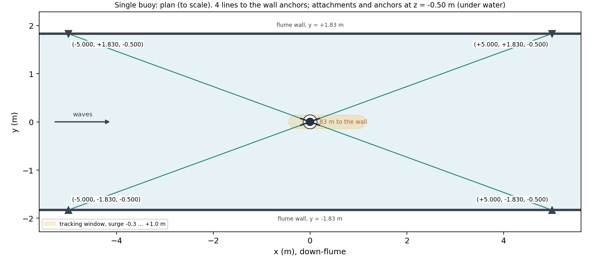
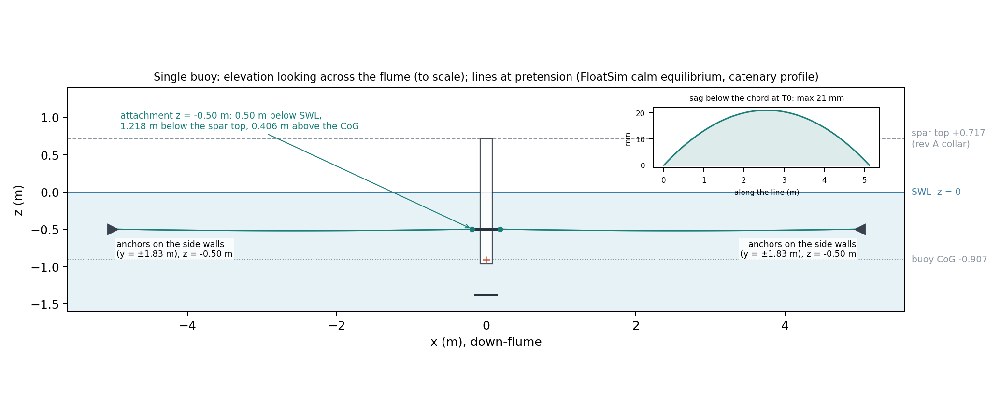
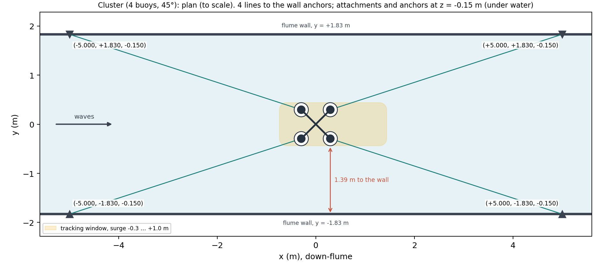
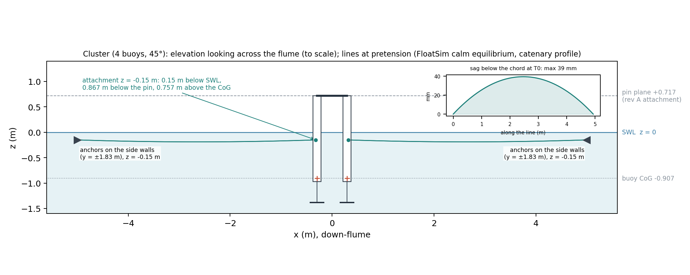
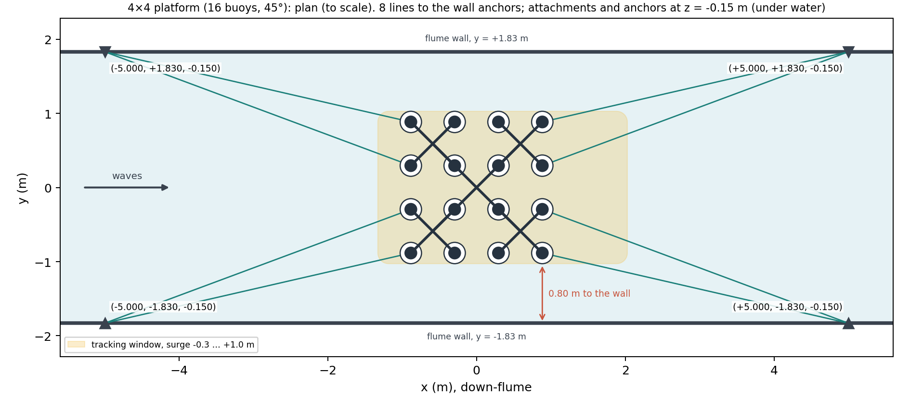
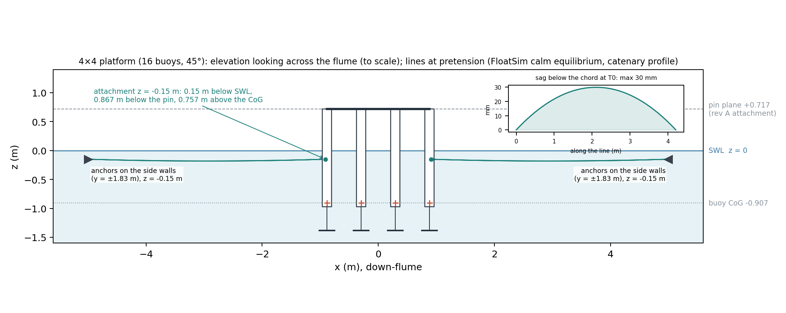
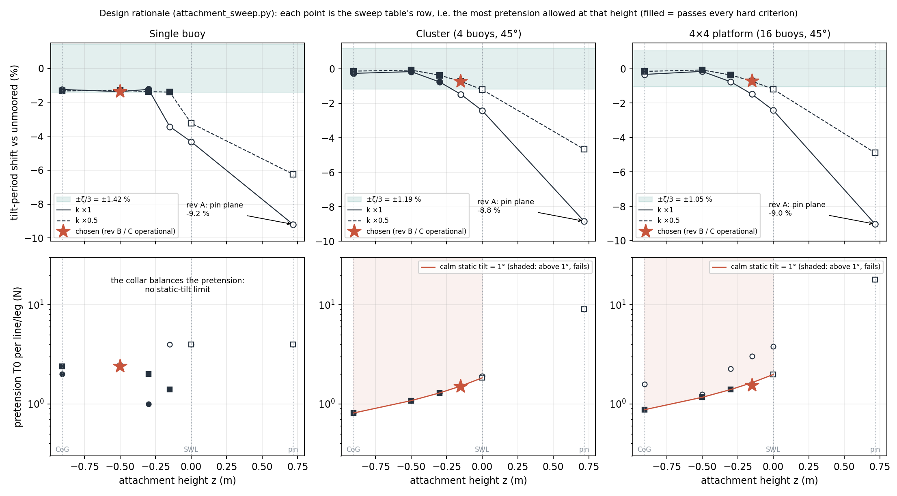
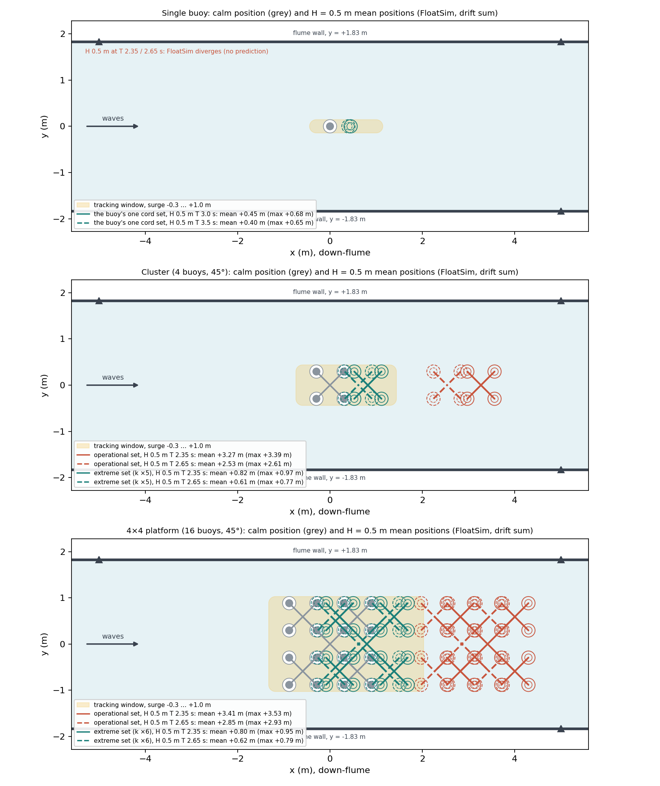

# Flume mooring specification — OSU Large Wave Flume (HWRL), 1:50 test articles

**REV C, 2026-09-25: two cord sets on the same anchors and attachment points** (supersedes rev B
`fb6ba5b`, whose design is the operational set). Generated by `build_spec.py` and
`mooring_figures.py` from FloatSim results; basis `DESIGN-BASIS.md` Phases F–G.

## Summary

| | single buoy | cluster | 4×4 platform |
|---|---|---|---|
| anchors (under water, on the side walls) | x ±5.0, y ±1.83, z -0.50 m | x ±5.0, y ±1.83, z -0.15 m | x ±5.0, y ±1.83, z -0.15 m |
| attachment points | slender radial collar r = 0.2 m on the spar, 4 points at z = -0.50 m | each of the 4 spars at z = -0.15 m | the 8 up-/down-stream row spars at z = -0.15 m (4 two-leg bridles) |
| lines (legs) | 4 | 4 | 8 |
| pretension at rest per line/leg, both sets (set by tension or calm tilt) | **2.40 N** | **1.44 N** | **1.42 N** |
| operational cord (response tests, H ≤ 0.12 m) | k 2.01 N/m (−13 / +30 %), L0 3.930 m (nominal T0 2.40 N), pre-stretch at rest 1195 mm, elongation ≥ 2.21 m (56 % of L0) | k 4.15 N/m (−13 / +30 %), L0 4.589 m (nominal T0 1.49 N), pre-stretch at rest 346 mm, elongation ≥ 0.63 m (14 % of L0) | k 8.32 N/m (−13 / +30 %), L0 4.038 / 4.208 m (nominal T0 1.54 N), pre-stretch at rest 171 mm, elongation ≥ 0.42 m (10 % of L0) |
| extreme cord (H = 0.2–0.5 m) | the same cord (one set) | **k ×5**: k 20.75 N/m (minimum; −0 / +30 %), L0 4.866 m (nominal T0 1.73 N), pre-stretch at rest 69 mm, elongation ≥ 1.33 m (27 % of L0) | **k ×6**: k 49.91 N/m (minimum; −0 / +30 %), L0 4.181 / 4.350 m (nominal T0 2.14 N), pre-stretch at rest 28 mm, elongation ≥ 1.13 m (27 % of L0) |
| max line tension: operational / extreme | 3.54 N | 2.09 / 22.12 N | 2.81 / 45.27 N |
| anchor working load ×3 (max of both sets) | **10.6 N** | **66.4 N** | **267.4 N** |
| calm static tilt, FloatSim: operational / extreme | 0.00° (collar) | 1.00° / 1.00° | 1.00° / 1.00° |
| H = 0.5 m max surge (limit +1.0 m) | 0.68 m (predicted cases) | 0.97 m (extreme set; operational set 3.39 m) | 0.95 m (extreme set; operational set 3.53 m) |
| tilt-period shift vs unmoored: operational (limit ζ/3) / extreme (declared) | -1.37 % (≤ 1.42 %) | -0.73 % (≤ 1.19 %) / -3.77 % | -0.72 % (≤ 1.05 %) / -4.65 % |

- **Two cord sets, one rig.** Swap the cords between the response series (operational set,
  H ≤ 0.12 m) and the extreme series (extreme set, H = 0.2–0.5 m). The anchors, the attachment
  points and the AT-REST tension stay the same, so the calm geometry is the same.
- **Installation checks, for each set** (§5):
  - the calm static tilt, which checks the pretension (1° at the design at-rest tension on the
    cluster and platform);
  - a static pull against the predicted pull stiffness;
  - surge and sway decays against the predicted periods.
- **Extremes:**
  - Run them in increasing H with live offset monitoring.
  - Run the buoy's extremes LAST, with a height ramp, and watch its yaw: 3 of its cases have no
    reliable FloatSim prediction.
- **Buoy collar:** a SLENDER rod or wire spreader, round section ≤ 25 mm. A disk would add
  ≈ 21 kg.
- **Facility assumptions F1–F7** (next page) must be confirmed with HWRL before any hardware is
  bought. F1: underwater wall anchors.

## Facility assumptions to CONFIRM WITH HWRL BEFORE BUYING HARDWARE

None of these is a confirmed facility fact. The design rests on all of them.

| # | Assumption | Value this specification uses | If it proves false |
|---|---|---|---|
| F1 | Anchors can be fixed on the side walls **under water, at each article's attachment depth** | anchors at x = ±5.0 m, y = ±1.83 m, **z = -0.50 m (buoy), -0.15 m (cluster), -0.15 m (platform)** | A higher or lower anchor slopes the line. Its vertical pull at the attachment adds calm tilt and tilt coupling, so the attachment sweep must be re-run for the real anchor depth. |
| F2 | Wall anchor rating | per-anchor working-load limit, the larger of the two cord sets (×3 on the FloatSim peak): **buoy 10.6 N, cluster 66.4 N, platform 267.4 N** | Lower than these is unlikely to bind; confirm. |
| F3 | Wave height per period, steepness | H/λ ≤ 0.08 at 2.7 m depth: H 0.5 m only for T ≥ 2.01 s (and from 2.35 s by the 3° tilt rule), H 0.35 m for T ≥ 1.675 s | Cases outside the wavemaker envelope drop out. |
| F4 | Water depth | 2.7 m | The drift bound falls for deeper water; periods unchanged. |
| F5 | Test-section position vs the wavemaker and beach | a clean regular-wave window ≥ 2–3 min at the article, which sits on the flume centreline | Shorter windows do not settle the lightly damped resonances (ζ ≈ 3–4 %). |
| F6 | Tracking field of view | surge −0.3 … **+1.0 m** (down-flume), sway ±0.1 m, plus the article footprint (platform 2.06 m wide at 45°) | With the extreme set, H = 0.5 m stays within +1.0 m at the two worst periods run (§3b). A smaller window needs a stiffer extreme set. |
| F7 | **Soft-mooring cord, usable submerged, in two stiffnesses per article** | elastic cord: the operational set (secant stiffness within −13 / +30 % of target) and the extreme set (a MINIMUM stiffness, −0 / +30 %), stiffness and elongation per the tables; submerged weight ≈ 0.02 N/m | Without it, the lines need farther anchors (longer lines, lower strain) or another soft element. Redesign. |

## 1. Layout and the two cord sets

- An X-spread of four soft lines to the side walls, 20.1° off the flume axis. The platform's four
  lines are 2-leg bridles (8 legs) to the two row spars of each up- and down-stream half-row.
- **Attachments are below still water, and each anchor is at the same depth**, so every line runs
  level (figures in §2):
  - **single buoy:** a slender radial collar of r = 0.2 m on the spar at z = -0.50 m, one line at
    the point facing each anchor (§4);
  - **cluster:** each spar at z = -0.15 m;
  - **platform:** the 8 up- and down-stream row spars at z = -0.15 m.
- Each line or leg is an **elastic cord**, with short stiff leads or shackles if needed, of
  unstretched length L0. It is pre-stretched to the pretension T0 when attached: the tension at
  rest ≈ k × (chord − L0).
- **Two cord sets** (rev C):
  - The **operational set** is rev B unchanged. It is used for every response test
    (H ≤ 0.12 m), and it disturbs the article least (§3a). Calm static tilt ≤ 1° is now
    CONFIRMED by Xabier.
  - The **extreme set** is a stiffer cord at the same at-rest tension on the same anchors and
    attachment points. It is used for the H = 0.2–0.5 m load and survival tests, and keeps the article in the
    tracking window (§3b).
  - The buoy needs no second set: its predicted H = 0.5 m offsets stay inside +1.0 m.
- Why two sets:
  - Rev B's decision rule omitted the confirmed excursion criterion (Phase B criterion 4).
  - The conflict itself is real: minimal interference needs soft lines, and station-keeping in
    extreme waves needs stiff ones.
  - Two cord sets resolve it without compromising either design.
- Frame for all coordinates (the TRUE flume frame): the origin is at the article's calm centre, on
  the flume centreline, at still water. x runs down-flume (the wave direction), y across, z up.
- What is conservative in these numbers:
  - the **drift sum**: the full recorded fixed-body drift bound, applied in-run at each spar's
    waterline, plus FloatSim's own mean wave force on the moving body;
  - **working loads ×3** and **elongation capacity ×1.25** on the worst predicted FloatSim values.

## 2. Per-article arrangement and line tables

The **up-flume lines (anchors at x = −5 m) carry the drift** and set every peak value. **Buy and
rig every line of a set to its up-flume values**, so the lines are interchangeable.

### 2a. Single buoy

*Single buoy: plan, to scale (mooring_figures.py, from spec_statics.json)*

*Single buoy: elevation looking across the flume, to scale*

**One cord set** (response and extreme tests; its predicted H = 0.5 m offsets stay within +1 m). Peaks over every predicted run (§5):

| line | anchor (x, y, z) m | attachment (x, y, z) m | L0 unstretched | k target (band -13 / +30 %) | pretension T0 (at rest) | at-rest stretch | peak stretch | elongation capacity ×1.25 | max tension | working load ×3 |
|---|---|---|---|---|---|---|---|---|---|---|
| 1 (buoy) | (-5.000, +1.830, -0.500) | (-0.188, +0.069, -0.501) | 3.930 m | 2.01 N/m (1.75–2.61) | 2.40 N (2.40) | 1195 mm | 1.76 m | 2.21 m (56 % of L0) | 3.54 N | 10.6 N |
| 2 (buoy) | (-5.000, -1.830, -0.500) | (-0.188, -0.069, -0.501) | 3.930 m | 2.01 N/m (1.75–2.61) | 2.40 N (2.40) | 1195 mm | 1.76 m | 2.21 m (56 % of L0) | 3.54 N | 10.6 N |
| 3 (buoy) | (+5.000, +1.830, -0.500) | (+0.188, +0.069, -0.501) | 3.930 m | 2.01 N/m (1.75–2.61) | 2.40 N (2.40) | 1195 mm | 1.27 m | 1.58 m (40 % of L0) | 2.54 N | 7.6 N |
| 4 (buoy) | (+5.000, -1.830, -0.500) | (+0.188, -0.069, -0.501) | 3.930 m | 2.01 N/m (1.75–2.61) | 2.40 N (2.40) | 1195 mm | 1.27 m | 1.58 m (40 % of L0) | 2.54 N | 7.6 N |

Anchors (working-load limit = 3 × the larger design load of the cord sets):

| anchor (x, y, z) m | lines | design load, the cord set | anchor working-load limit ×3 (max of the sets) |
|---|---|---|---|
| (-5.000, +1.830, -0.500) | 1 | 3.54 N | **10.6 N** |
| (-5.000, -1.830, -0.500) | 2 | 3.54 N | **10.6 N** |
| (+5.000, +1.830, -0.500) | 3 | 2.54 N | **7.6 N** |
| (+5.000, -1.830, -0.500) | 4 | 2.54 N | **7.6 N** |

### 2b. Cluster (4 buoys at 45°)

*Cluster (4 buoys, 45°): plan, to scale (mooring_figures.py, from spec_statics.json)*

*Cluster (4 buoys, 45°): elevation looking across the flume, to scale*

**Operational cord set** (response tests, H ≤ 0.12 m). Peaks over its moored operational runs (§5):

| line | anchor (x, y, z) m | attachment (x, y, z) m | L0 unstretched | k target (band -13 / +30 %) | pretension T0 (at rest) | at-rest stretch | peak stretch | elongation capacity ×1.25 | max tension | working load ×3 |
|---|---|---|---|---|---|---|---|---|---|---|
| 1 (buoy2) | (-5.000, +1.830, -0.150) | (-0.322, +0.303, -0.150) | 4.589 m | 4.15 N/m (3.61–5.40) | 1.49 N (1.44) | 346 mm | 0.50 m | 0.63 m (14 % of L0) | 2.09 N | 6.3 N |
| 2 (buoy3) | (-5.000, -1.830, -0.150) | (-0.322, -0.303, -0.150) | 4.589 m | 4.15 N/m (3.61–5.40) | 1.49 N (1.44) | 346 mm | 0.50 m | 0.63 m (14 % of L0) | 2.09 N | 6.3 N |
| 3 (buoy1) | (+5.000, +1.830, -0.150) | (+0.322, +0.303, -0.150) | 4.589 m | 4.15 N/m (3.61–5.40) | 1.49 N (1.44) | 346 mm | 0.50 m | 0.62 m (14 % of L0) | 2.06 N | 6.2 N |
| 4 (buoy4) | (+5.000, -1.830, -0.150) | (+0.322, -0.303, -0.150) | 4.589 m | 4.15 N/m (3.61–5.40) | 1.49 N (1.44) | 346 mm | 0.50 m | 0.62 m (14 % of L0) | 2.06 N | 6.2 N |

**Extreme cord set, k ×5** (load / survival tests, H = 0.2–0.5 m). Same anchors, attachments and nominal T0. Its stiffness is a MINIMUM: a softer cord puts H = 0.5 m past +1 m, so the band is −0 / +30 %. Peaks over its H = 0.5 m runs (§5):

| line | anchor (x, y, z) m | attachment (x, y, z) m | L0 unstretched | k target (band +0 / +30 %) | pretension T0 (at rest) | at-rest stretch | peak stretch | elongation capacity ×1.25 | max tension | working load ×3 |
|---|---|---|---|---|---|---|---|---|---|---|
| 1 (buoy2) | (-5.000, +1.830, -0.150) | (-0.322, +0.303, -0.150) | 4.866 m | 20.75 N/m (20.75–26.98) | 1.73 N (1.44) | 69 mm | 1.07 m | 1.33 m (27 % of L0) | 22.12 N | 66.4 N |
| 2 (buoy3) | (-5.000, -1.830, -0.150) | (-0.322, -0.303, -0.150) | 4.866 m | 20.75 N/m (20.75–26.98) | 1.73 N (1.44) | 69 mm | 1.07 m | 1.33 m (27 % of L0) | 22.12 N | 66.4 N |
| 3 (buoy1) | (+5.000, +1.830, -0.150) | (+0.322, +0.303, -0.150) | 4.866 m | 20.75 N/m (20.75–26.98) | 1.73 N (1.44) | 69 mm | 0.00 m | 0.01 m (0 % of L0) | 0.10 N | 0.3 N |
| 4 (buoy4) | (+5.000, -1.830, -0.150) | (+0.322, -0.303, -0.150) | 4.866 m | 20.75 N/m (20.75–26.98) | 1.73 N (1.44) | 69 mm | 0.00 m | 0.01 m (0 % of L0) | 0.10 N | 0.3 N |

Anchors (working-load limit = 3 × the larger design load of the cord sets):

| anchor (x, y, z) m | lines | design load, operational | design load, extreme | anchor working-load limit ×3 (max of the sets) |
|---|---|---|---|---|
| (-5.000, +1.830, -0.150) | 1 | 2.09 N | 22.12 N | **66.4 N** |
| (-5.000, -1.830, -0.150) | 2 | 2.09 N | 22.12 N | **66.4 N** |
| (+5.000, +1.830, -0.150) | 3 | 2.06 N | 0.10 N | **6.2 N** |
| (+5.000, -1.830, -0.150) | 4 | 2.06 N | 0.10 N | **6.2 N** |

### 2c. 4×4 platform (16 buoys at 45°)

*4×4 platform (16 buoys, 45°): plan, to scale (mooring_figures.py, from spec_statics.json)*

*4×4 platform (16 buoys, 45°): elevation looking across the flume, to scale*

**Operational cord set** (response tests, H ≤ 0.12 m). Peaks over its moored operational runs (§5):

| line | anchor (x, y, z) m | attachment (x, y, z) m | L0 unstretched | k target (band -13 / +30 %) | pretension T0 (at rest) | at-rest stretch | peak stretch | elongation capacity ×1.25 | max tension | working load ×3 |
|---|---|---|---|---|---|---|---|---|---|---|
| 1 (buoy6) | (-5.000, +1.830, -0.150) | (-0.911, +0.890, -0.150) | 4.038 m | 8.32 N/m (7.24–10.81) | 1.54 N (1.42) | 171 mm | 0.34 m | 0.42 m (10 % of L0) | 2.81 N | 8.4 N |
| 2 (buoy7) | (-5.000, +1.830, -0.150) | (-0.910, +0.304, -0.150) | 4.208 m | 8.32 N/m (7.24–10.81) | 1.54 N (1.42) | 171 mm | 0.33 m | 0.41 m (10 % of L0) | 2.76 N | 8.3 N |
| 3 (buoy10) | (-5.000, -1.830, -0.150) | (-0.910, -0.304, -0.150) | 4.208 m | 8.32 N/m (7.24–10.81) | 1.54 N (1.42) | 171 mm | 0.33 m | 0.41 m (10 % of L0) | 2.76 N | 8.3 N |
| 4 (buoy11) | (-5.000, -1.830, -0.150) | (-0.911, -0.890, -0.150) | 4.038 m | 8.32 N/m (7.24–10.81) | 1.54 N (1.42) | 171 mm | 0.34 m | 0.42 m (10 % of L0) | 2.81 N | 8.4 N |
| 5 (buoy1) | (+5.000, +1.830, -0.150) | (+0.911, +0.890, -0.150) | 4.038 m | 8.32 N/m (7.24–10.81) | 1.54 N (1.42) | 171 mm | 0.31 m | 0.39 m (10 % of L0) | 2.60 N | 7.8 N |
| 6 (buoy4) | (+5.000, +1.830, -0.150) | (+0.910, +0.304, -0.150) | 4.208 m | 8.32 N/m (7.24–10.81) | 1.54 N (1.42) | 171 mm | 0.31 m | 0.38 m (9 % of L0) | 2.55 N | 7.7 N |
| 7 (buoy13) | (+5.000, -1.830, -0.150) | (+0.910, -0.304, -0.150) | 4.208 m | 8.32 N/m (7.24–10.81) | 1.54 N (1.42) | 171 mm | 0.31 m | 0.38 m (9 % of L0) | 2.55 N | 7.7 N |
| 8 (buoy16) | (+5.000, -1.830, -0.150) | (+0.911, -0.890, -0.150) | 4.038 m | 8.32 N/m (7.24–10.81) | 1.54 N (1.42) | 171 mm | 0.31 m | 0.39 m (10 % of L0) | 2.60 N | 7.8 N |

**Extreme cord set, k ×6** (load / survival tests, H = 0.2–0.5 m). Same anchors, attachments and nominal T0. Its stiffness is a MINIMUM: a softer cord puts H = 0.5 m past +1 m, so the band is −0 / +30 %. Peaks over its H = 0.5 m runs (§5):

| line | anchor (x, y, z) m | attachment (x, y, z) m | L0 unstretched | k target (band +0 / +30 %) | pretension T0 (at rest) | at-rest stretch | peak stretch | elongation capacity ×1.25 | max tension | working load ×3 |
|---|---|---|---|---|---|---|---|---|---|---|
| 1 (buoy6) | (-5.000, +1.830, -0.150) | (-0.911, +0.890, -0.150) | 4.181 m | 49.91 N/m (49.91–64.88) | 2.14 N (1.42) | 28 mm | 0.91 m | 1.13 m (27 % of L0) | 45.27 N | 135.8 N |
| 2 (buoy7) | (-5.000, +1.830, -0.150) | (-0.910, +0.304, -0.150) | 4.350 m | 49.91 N/m (49.91–64.88) | 2.14 N (1.42) | 28 mm | 0.88 m | 1.10 m (25 % of L0) | 43.87 N | 131.6 N |
| 3 (buoy10) | (-5.000, -1.830, -0.150) | (-0.910, -0.304, -0.150) | 4.350 m | 49.91 N/m (49.91–64.88) | 2.14 N (1.42) | 28 mm | 0.88 m | 1.10 m (25 % of L0) | 43.87 N | 131.6 N |
| 4 (buoy11) | (-5.000, -1.830, -0.150) | (-0.911, -0.890, -0.150) | 4.181 m | 49.91 N/m (49.91–64.88) | 2.14 N (1.42) | 28 mm | 0.91 m | 1.13 m (27 % of L0) | 45.27 N | 135.8 N |
| 5 (buoy1) | (+5.000, +1.830, -0.150) | (+0.911, +0.890, -0.150) | 4.181 m | 49.91 N/m (49.91–64.88) | 2.14 N (1.42) | 28 mm | 0.00 m | 0.00 m (0 % of L0) | 0.07 N | 0.2 N |
| 6 (buoy4) | (+5.000, +1.830, -0.150) | (+0.910, +0.304, -0.150) | 4.350 m | 49.91 N/m (49.91–64.88) | 2.14 N (1.42) | 28 mm | 0.00 m | 0.00 m (0 % of L0) | 0.08 N | 0.2 N |
| 7 (buoy13) | (+5.000, -1.830, -0.150) | (+0.910, -0.304, -0.150) | 4.350 m | 49.91 N/m (49.91–64.88) | 2.14 N (1.42) | 28 mm | 0.00 m | 0.00 m (0 % of L0) | 0.08 N | 0.2 N |
| 8 (buoy16) | (+5.000, -1.830, -0.150) | (+0.911, -0.890, -0.150) | 4.181 m | 49.91 N/m (49.91–64.88) | 2.14 N (1.42) | 28 mm | 0.00 m | 0.00 m (0 % of L0) | 0.07 N | 0.2 N |

Anchors (working-load limit = 3 × the larger design load of the cord sets):

| anchor (x, y, z) m | lines | design load, operational | design load, extreme | anchor working-load limit ×3 (max of the sets) |
|---|---|---|---|---|
| (-5.000, +1.830, -0.150) | 1, 2 | 5.57 N | 89.14 N | **267.4 N** |
| (-5.000, -1.830, -0.150) | 3, 4 | 5.57 N | 89.14 N | **267.4 N** |
| (+5.000, +1.830, -0.150) | 5, 6 | 5.15 N | 0.14 N | **15.5 N** |
| (+5.000, -1.830, -0.150) | 7, 8 | 5.15 N | 0.14 N | **15.5 N** |

## 3. Design: the attachment height (rev B) and the extreme cord set (rev C)

### 3a. Attachment height and the operational set

- Rev A attached at the pin plane (+0.717 m) to remove calm-water tilt. At the design pretension
  and stiffness its tilt period shifts **buoy -9.2 % against ±1.42 %, cluster -8.8 % against ±1.19 %, platform -9.0 % against ±1.05 %**, several times what the resonance
  tolerates.
- The two effects act about different points:
  - The static pretension moment acts about the PIN.
  - The dynamic coupling (≈ k·h²) acts about the tilt mode's rotation centre, near the CoG.
- **The rule** (select, do not ask). HARD criteria:
  - tilt-period shift vs the unmoored article ≤ ζ/3 (ζ at H = 0.04 m);
  - heave shift ≤ 1 %;
  - calm static tilt ≤ 1° (now confirmed);
  - surge ≥ 14 s;
  - no slack in the operational band with the drift sum.
- Selection: the most pretension, then the attachment closest to the waterline, then the stiffest
  surge.

*Design rationale: tilt-period shift and pretension against attachment height (the sweep table's rows)*

The sweep. Each row is the most pretension that passes at that height and k. Where none passes,
it is the most that keeps the static tilt and the operational band, and the row shows what fails.
The static tilt is the estimate, except in the chosen rows (FloatSim's settle):

| article | attachment z | k | T0 per line/leg | tilt shift (limit) | heave shift | calm static tilt | surge | op. T_min/T0 | verdict |
|---|---|---|---|---|---|---|---|---|---|
| buoy | pin +0.717 m | ×1 | 4.00 N | -9.19 % (1.42) | -0.83 % | 0.00° | 16.4 s | 0.80 | fails: tilt -9.19 % |
| buoy | pin +0.717 m | ×0.5 | 4.00 N | -6.23 % (1.42) | -0.83 % | 0.00° | 22.6 s | 0.90 | fails: tilt -6.23 % |
| buoy | +0.00 m | ×1 | 4.00 N | -4.32 % (1.42) | -0.83 % | 0.00° | 16.4 s | 0.90 | fails: tilt -4.32 % |
| buoy | +0.00 m | ×0.5 | 4.00 N | -3.23 % (1.42) | -0.83 % | 0.00° | 22.6 s | 0.95 | fails: tilt -3.23 % |
| buoy | -0.15 m | ×1 | 4.00 N | -3.43 % (1.42) | -0.83 % | 0.00° | 16.4 s | 0.92 | fails: tilt -3.43 % |
| buoy | -0.15 m | ×0.5 | 1.40 N | -1.40 % (1.42) | -0.29 % | 0.00° | 23.4 s | 0.88 | pass |
| buoy | -0.30 m | ×1 | 1.00 N | -1.23 % (1.42) | -0.21 % | 0.00° | 16.8 s | 0.75 | pass |
| buoy | -0.30 m | ×0.5 | 2.00 N | -1.37 % (1.42) | -0.42 % | 0.00° | 23.2 s | 0.94 | pass |
| buoy | -0.50 m | ×1 | 2.40 N | -1.37 % (1.42) | -0.50 % | 0.00° | 16.6 s | 0.94 | **CHOSEN** |
| buoy | -0.50 m | ×0.5 | 2.40 N | -1.29 % (1.42) | -0.50 % | 0.00° | 23.1 s | 0.96 | pass |
| buoy | -0.91 (CoG) m | ×1 | 2.00 N | -1.24 % (1.42) | -0.42 % | 0.00° | 16.6 s | 0.94 | pass |
| buoy | -0.91 (CoG) m | ×0.5 | 2.40 N | -1.33 % (1.42) | -0.50 % | 0.00° | 23.1 s | 0.96 | pass |
| cluster | pin +0.717 m | ×1 | 9.01 N | -8.83 % (1.19) | -0.49 % | 0.00° | 16.2 s | 0.63 | fails: tilt -8.83 % |
| cluster | pin +0.717 m | ×0.5 | 9.01 N | -4.66 % (1.19) | -0.49 % | 0.00° | 22.7 s | 0.82 | fails: tilt -4.66 % |
| cluster | +0.00 m | ×1 | 1.92 N | -2.42 % (1.19) | -0.10 % | 1.05° | 16.4 s | 0.15 | fails: tilt -2.42 %, static 1.05°, op slack 0.1498 (even the least T0 that keeps the operational band taut) |
| cluster | +0.00 m | ×0.5 | 1.83 N | -1.21 % (1.19) | -0.10 % | 1.00° | 23.1 s | 0.55 | fails: tilt -1.21 % |
| cluster | -0.15 m | ×1 | 1.52 N | -1.48 % (1.19) | -0.08 % | 1.00° | 16.4 s | 0.15 | fails: tilt -1.48 % |
| cluster | -0.15 m | ×0.5 | 1.49 N | -0.73 % (1.19) | -0.08 % | 1.00° | 23.1 s | 0.56 | **CHOSEN** |
| cluster | -0.30 m | ×1 | 1.29 N | -0.76 % (1.19) | -0.07 % | 1.00° | 16.5 s | 0.26 | pass |
| cluster | -0.30 m | ×0.5 | 1.29 N | -0.37 % (1.19) | -0.07 % | 1.00° | 23.2 s | 0.63 | pass |
| cluster | -0.50 m | ×1 | 1.08 N | -0.16 % (1.19) | -0.06 % | 1.00° | 16.5 s | 0.52 | pass |
| cluster | -0.50 m | ×0.5 | 1.08 N | -0.07 % (1.19) | -0.06 % | 1.00° | 23.2 s | 0.66 | pass |
| cluster | -0.91 (CoG) m | ×1 | 0.81 N | -0.26 % (1.19) | -0.05 % | 1.00° | 16.8 s | 0.24 | pass |
| cluster | -0.91 (CoG) m | ×0.5 | 0.81 N | -0.13 % (1.19) | -0.04 % | 1.00° | 23.4 s | 0.58 | pass |
| platform | pin +0.717 m | ×1 | 18.03 N | -9.04 % (1.05) | -0.10 % | 0.00° | 16.1 s | 0.63 | fails: tilt -9.04 % |
| platform | pin +0.717 m | ×0.5 | 18.03 N | -4.89 % (1.05) | -0.10 % | 0.00° | 22.5 s | 0.82 | fails: tilt -4.89 % |
| platform | +0.00 m | ×1 | 3.79 N | -2.42 % (1.05) | -0.05 % | 1.91° | 16.2 s | 0.15 | fails: tilt -2.42 %, static 1.91° (even the least T0 that keeps the operational band taut) |
| platform | +0.00 m | ×0.5 | 1.98 N | -1.19 % (1.05) | -0.03 % | 1.00° | 23.0 s | 0.18 | fails: tilt -1.19 % |
| platform | -0.15 m | ×1 | 3.02 N | -1.48 % (1.05) | -0.04 % | 1.84° | 16.2 s | 0.15 | fails: tilt -1.48 %, static 1.84° (even the least T0 that keeps the operational band taut) |
| platform | -0.15 m | ×0.5 | 1.54 N | -0.72 % (1.05) | -0.03 % | 1.00° | 23.0 s | 0.18 | **CHOSEN** |
| platform | -0.30 m | ×1 | 2.26 N | -0.76 % (1.05) | -0.03 % | 1.61° | 16.3 s | 0.15 | fails: static 1.61° (even the least T0 that keeps the operational band taut) |
| platform | -0.30 m | ×0.5 | 1.40 N | -0.36 % (1.05) | -0.02 % | 1.00° | 23.0 s | 0.34 | pass |
| platform | -0.50 m | ×1 | 1.26 N | -0.16 % (1.05) | -0.02 % | 1.08° | 16.4 s | 0.15 | fails: static 1.08° (even the least T0 that keeps the operational band taut) |
| platform | -0.50 m | ×0.5 | 1.17 N | -0.07 % (1.05) | -0.02 % | 1.00° | 23.1 s | 0.50 | pass |
| platform | -0.91 (CoG) m | ×1 | 1.59 N | -0.33 % (1.05) | -0.03 % | 1.82° | 16.3 s | 0.15 | fails: static 1.82°, op slack 0.1485 (even the least T0 that keeps the operational band taut) |
| platform | -0.91 (CoG) m | ×0.5 | 0.88 N | -0.15 % (1.05) | -0.02 % | 1.00° | 23.3 s | 0.18 | pass |

- **Residual interference:**
  - The operational set still shifts the tilt resonance, within ζ/3 and modelled by FloatSim.
  - That is acceptable for validating FloatSim.
  - It **must be declared** in any claim about the free (unmoored) response.
- ⚠ **The buoy's yaw vs tilt conflict:**
  - The collar's pretension stiffens pitch and yaw together (∝ T0·r), so every buoy design that
    passes ζ/3 has a yaw period ≥ 1.12 s.
  - FloatSim finds part of the buoy's extreme band unstable in yaw (§6).
  - A pitch-neutral collar (e.g. a cross-flume bar) is a follow-up.

### 3b. The extreme cord set

**Why:** the operational set at H = 0.5 m (rev B's runs):

| article | set | case (drift sum) | min / max line tension | slack lines: peak re-tension | mean offset (range) | max tilt | max yaw | line above the local surface | validity |
|---|---|---|---|---|---|---|---|---|---|
| cluster | operational (rev B) | H 0.5 m, T 2.35 s | 0.04 / 15.23 N | stay slack (≤ 0.05 N, their hanging weight): no re-tension in the wave train | 3.27 m (3.15–3.39) **> +1 m** | 15.3° | 0.70° | breaks the surface by 0.19 m | indicative (tilt > 5.7°) |
| cluster | operational (rev B) | H 0.5 m, T 2.65 s | 0.05 / 12.01 N | stay slack (≤ 0.05 N, their hanging weight): no re-tension in the wave train | 2.53 m (2.46–2.61) **> +1 m** | 12.9° | 0.47° | breaks the surface by 0.18 m | indicative (tilt > 5.7°) |
| platform | operational (rev B) | H 0.5 m, T 2.35 s | 0.04 / 29.43 N | stay slack (≤ 0.04 N, their hanging weight): no re-tension in the wave train | 3.41 m (3.30–3.53) **> +1 m** | 22.7° | 1.78° | breaks the surface by 0.18 m | indicative (tilt > 5.7°) |
| platform | operational (rev B) | H 0.5 m, T 2.65 s | 0.04 / 24.70 N | stay slack (≤ 0.05 N, their hanging weight): no re-tension in the wave train | 2.85 m (2.78–2.93) **> +1 m** | 19.4° | 1.38° | breaks the surface by 0.17 m | indicative (tilt > 5.7°) |

**Selection:**
- The rule: the smallest cord stiffness, as a multiple of the operational k, that keeps the
  article inside the tracking window at H = 0.5 m. It is checked at T = 2.35 s (the largest
  admissible drift) and 2.65 s (the tilt/heave resonance), with the conservative drift sum
  applied in-run (FloatSim).
- Two readings of "inside the window":
  - The confirmed criterion 4 is mean offset + dynamic amplitude ≤ 1.0 m, i.e. the run's maximum
    surge. **The spec uses it.**
  - The mean offset alone (Xabier's wording) would allow ×4.5 (cluster) and ×5
    (platform).
- Chosen: **cluster ×5, platform ×6.**

| article | k (× operational) | T = 2.35 s: mean / max surge | T = 2.65 s: mean / max surge | peak line tension | slack lines: peak re-tension | verdict (max surge ≤ 1.0 m, both periods) |
|---|---|---|---|---|---|---|
| cluster | ×3.5 (14.53 N/m) | 1.18 / 1.30 m | 0.87 / 1.02 m | 20.02 N | 0.07 N | fails |
| cluster | ×4 (16.60 N/m) | 1.04 / 1.17 m | 0.77 / 0.92 m | 20.80 N | 0.08 N | fails |
| cluster | ×4.5 (18.68 N/m) | 0.93 / 1.07 m | 0.69 / 0.84 m | 21.48 N | 0.09 N | fails (mean alone passes) |
| cluster | ×5 (20.75 N/m) | 0.83 / 0.98 m | 0.62 / 0.78 m | 22.12 N | 0.09 N | **CHOSEN** |
| cluster | ×5.5 (22.83 N/m) | 0.76 / 0.91 m | 0.57 / 0.73 m | 22.76 N | 0.10 N | pass |
| cluster | ×6 (24.90 N/m) | 0.69 / 0.85 m | 0.53 / 0.68 m | 23.44 N | 0.12 N | pass |
| cluster | **×5 FINAL** (at-rest-matched T0) | 0.82 / 0.97 m | 0.61 / 0.77 m | 22.12 N | 0.10 N | **PASS: the spec** |
| platform | ×3.5 (29.11 N/m) | 1.30 / 1.41 m | 1.00 / 1.15 m | 38.60 N | 0.05 N | fails |
| platform | ×4 (33.27 N/m) | 1.16 / 1.29 m | 0.89 / 1.05 m | 40.09 N | 0.06 N | fails |
| platform | ×4.5 (37.43 N/m) | 1.05 / 1.18 m | 0.80 / 0.97 m | 41.44 N | 0.06 N | fails |
| platform | ×5 (41.59 N/m) | 0.95 / 1.09 m | 0.74 / 0.90 m | 42.72 N | 0.07 N | fails (mean alone passes) |
| platform | ×5.5 (45.75 N/m) | 0.88 / 1.02 m | 0.68 / 0.85 m | 43.99 N | 0.07 N | fails (mean alone passes) |
| platform | ×6 (49.91 N/m) | 0.81 / 0.96 m | 0.63 / 0.81 m | 45.28 N | 0.07 N | **CHOSEN** |
| platform | **×6 FINAL** (at-rest-matched T0) | 0.80 / 0.95 m | 0.62 / 0.79 m | 45.27 N | 0.08 N | **PASS: the spec** |

*H = 0.5 m mean positions of both cord sets against the tracking window (FloatSim, drift sum)*

- **Declared, not criteria:** these tests measure loads and survival, and the tank and the model
  see the same mooring. The extreme set's modal periods against the unmoored article: cluster tilt -3.77 %, heave -0.09 %, surge 10.4 s, platform tilt -4.65 %, heave -0.03 %, surge 9.4 s.
  - ⚠ The surge period is below the confirmed criterion 2 (≥ 14 s), so the wave-frequency surge
    is amplified by 1/(1 − (T/T_surge)²): cluster +13 % (T_surge 10.5 s) / platform +15 % (T_surge 9.6 s) at T = 3.5 s.
  - The regular-wave matrix has no difference-frequency forcing.
  - Criteria 2 and 4 cannot both hold for this set at H = 0.5 m: ≥ 14 s caps the stiffness at
    about ×2.8, which leaves ≳ 1.5 m of offset (extrapolated from the k scan).
- **Pretension: the same AT-REST tension, not the same nominal T0.**
  - The code's nominal T0 is the tension at the design (untilted) chord. The calm 1° tilt moves
    each attachment δ ≈ 15 mm towards its anchor, so the at-rest tension is T0 − k·δ, and a
    stiffer cord loses more.
  - The extreme set is therefore tensioned to the operational set's at-rest tension. Its line
    forces at the calm geometry are then identical, so **the operational settle is its calm
    equilibrium: the same 1.00° / 1.00° calm tilt, no new settle**. FloatSim's joint-projected static residual at the operational settle: cluster 0.0077 N with the operational lines, 0.0073 N with the extreme lines (nominal T0 instead: 0.13 N); platform 0.0024 N with the operational lines, 0.0022 N with the extreme lines (nominal T0 instead: 0.24 N) (extreme_set_residuals.json).
  - Its L0 and nominal T0 in the tables implement this.
- **Raising T0** (optional): Not run, because there is nothing to cut. In the final runs the down-flume lines go slack and **stay slack through the wave train** (their peak is their hanging weight). Their pre-stretch is far below the mean offset, and it stays so even at the 3° calm-tilt cap (T0 ≈ 3× the at-rest tension: pre-stretch cluster 208 mm against a mean offset ≥ 0.61 m; platform 85 mm against a mean offset ≥ 0.62 m). Raising T0 would only add to the up-flume peak.

## 4. Hardware

- **Elastic cord, usable submerged: two sets for the cluster and platform, one for the buoy.**
  - It must hold its secant stiffness over the working stretch (at-rest to peak):
    - the operational set within −13 / +30 % of the target;
    - the extreme set **at or above** its target, up to +30 %: softer moves the H = 0.5 m cases
      out of the tracking window.
  - Required elongation capacity: the tables (×1.25 on the FloatSim peak stretch). If the cord is
    shorter than L0 (a stiff lead in series), its strain rises in proportion.
  - Hysteresis is not modelled. It damps the slow modes and shifts the mean position by half the
    loading/unloading gap, which the pull test measures.
- **Pulley and counterweight (constant tension): rejected** (rev A §3). All its restoring is
  geometric, so it is far too soft in surge.
- **Buoy collar: a SLENDER spreader.** The collar is under water, an appendage the model does not
  include:
  - It has 4 arms of r = 0.2 m, 0.8 m in total. The added-mass budget is **0.4 kg**,
    so a round section is at most **25 mm** in diameter (added mass ≈ ρπD²/4 per metre in
    heave).
  - A 10 mm rod adds 0.06 kg and carries the peak line tension (3.54 N at the arm
    tip) at ≈ 7 MPa of bending stress at the root, fine in aluminium or steel. A
    tensioned wire spreader is also acceptable.
  - **A disk is NOT acceptable:** a solid disk of r = 0.2 m would add ≈ 21 kg of heave added
    mass (the heave plate's own is ≈ 7.9 kg).

## 5. Installation checks (each cord set, installed, before any waves)

- **Calm static tilt: the pretension check.**
  - On the cluster and platform the calm tilt IS the pretension gauge: FloatSim gives
    1.00° / 1.00° (operational) and 1.00° / 1.00° (extreme) at the design T0 (cluster / platform).
  - It is linear in the at-rest tension: ≈ 0.70°/N / 0.70°/N.
  - The extreme set's pre-stretch is only 69 mm / 28 mm, so a length error of a few mm is a large
    T0 error. **Set the extreme set's T0 by tension or by the calm tilt, not by length.**
  - The buoy's collar balances the pretension (calm tilt 0): measure its line tension directly.
- **Static pull and decays:**
  - the static pull is a horizontal pull through the article centre at the attachment depth,
    force against offset;
  - the free decays start from ~0.3 m surge and ~0.1 m sway;
  - both are compared with the FloatSim predictions below.
  - The buoy's yaw decay is not predictable in FloatSim.

| article | cord set | surge period | sway period | yaw period | surge pull K / F at 0.25, 0.5 m | sway pull K / F at 0.1 m | yaw pull K / M at 5° | calm static tilt (FloatSim settle) |
|---|---|---|---|---|---|---|---|---|
| buoy | one set | 16.6 s | 26.4 s | 1.12 s | 7.31 N/m / 1.83, 3.65 N | 2.60 N/m / 0.260 N | 2.00 N·m/rad / 0.174 N·m | 0.00° |
| cluster | operational | 23.1 s | 51.6 s | 24.78 s | 15.05 N/m / 3.72, 6.36 N | 2.64 N/m / 0.264 N | 3.06 N·m/rad / 0.268 N·m | 1.00° |
| cluster | extreme | 10.5 s | 28.2 s | 18.75 s | 73.17 N/m / 11.96, 21.61 N | 8.83 N/m / 0.877 N | 5.35 N·m/rad / 0.471 N·m | 1.00° |
| platform | operational | 23.0 s | 59.0 s | 33.40 s | 60.63 N/m / 12.65, 20.66 N | 8.11 N/m / 0.812 N | 28.96 N·m/rad / 2.547 N·m | 1.00° |
| platform | extreme | 9.6 s | 28.3 s | 18.08 s | 349.33 N/m / 50.99, 97.63 N | 35.30 N/m / 3.189 N | 98.86 N·m/rad / 7.512 N·m | 1.00° |

The surge and sway periods are the round-1 FloatSim decays scaled by √(K_decay / K) (same
effective mass).

## 6. Predicted envelope

**Operational set, operational band** (cluster and platform; FloatSim, the moored design, the
drift sum):

| article | case (drift sum) | min / max line tension | T_min / T0 (≥ 0.15) | mean offset (range) | max tilt | max yaw | validity |
|---|---|---|---|---|---|---|---|
| cluster | H 0.12 m, T 1.4 s | 1.04 / 1.83 N | 0.73 PASS | 0.07 m (0.05–0.09) | 2.5° | 7.9e-04° | LEVEL1 valid |
| cluster | H 0.12 m, T 2.84 s | 0.81 / 2.09 N | 0.56 PASS | -0.00 m (-0.04–0.04) | 17.6° | 2.1e-02° | indicative (tilt > 5.7°) |
| platform | H 0.12 m, T 1.4 s | 0.87 / 1.99 N | 0.61 PASS | 0.06 m (0.05–0.07) | 2.2° | 3.2e-03° | LEVEL1 valid |
| platform | H 0.12 m, T 2.9 s | 0.27 / 2.81 N | 0.19 PASS | 0.00 m (-0.05–0.06) | 17.5° | 3.6e-02° | indicative (tilt > 5.7°) |

**Extreme set, H = 0.5 m** (cluster and platform; FloatSim, the drift sum):

| article | set | case (drift sum) | min / max line tension | slack lines: peak re-tension | mean offset (range) | max tilt | max yaw | line above the local surface | validity |
|---|---|---|---|---|---|---|---|---|---|
| cluster | extreme, k ×5 | H 0.5 m, T 2.35 s | 0.06 / 22.12 N | stay slack (≤ 0.07 N, their hanging weight): no re-tension in the wave train | 0.82 m (0.66–0.97) | 21.6° | 0.92° | breaks the surface by 0.18 m | indicative (tilt > 5.7°) |
| cluster | extreme, k ×5 | H 0.5 m, T 2.65 s | 0.06 / 20.28 N | stay slack (≤ 0.10 N, their hanging weight): no re-tension in the wave train | 0.61 m (0.45–0.77) | 30.5° | 0.81° | breaks the surface by 0.17 m | indicative (tilt > 5.7°) |
| platform | extreme, k ×6 | H 0.5 m, T 2.35 s | 0.05 / 45.27 N | stay slack (≤ 0.06 N, their hanging weight): no re-tension in the wave train | 0.80 m (0.64–0.95) | 27.9° | 2.55° | breaks the surface by 0.17 m | indicative (tilt > 5.7°) |
| platform | extreme, k ×6 | H 0.5 m, T 2.65 s | 0.05 / 44.69 N | stay slack (≤ 0.08 N, their hanging weight): no re-tension in the wave train | 0.62 m (0.44–0.79) | 32.9° | 2.32° | breaks the surface by 0.16 m | indicative (tilt > 5.7°) |

**Single buoy** (one cord set; FloatSim, the drift sum, dt = 0.0025 s, 210 s).
- *stable*: yaw at round-off.
- *yaw grows*: the model grows yaw, still < 1° at the end of the run.
- *diverges*: no prediction.

| H | T | FloatSim | max tilt | max yaw | T_min / T0 | max tension | slack lines: peak re-tension | surge range |
|---|---|---|---|---|---|---|---|---|
| 0.04 m | 2.75 s | stable | 9.4° | 3.6e-11° | 0.97 | 2.46 N | none | -0.04–0.04 m |
| 0.12 m | 2.45 s | stable | 9.5° | 2.9e-11° | 0.94 | 2.55 N | none | -0.01–0.01 m |
| 0.12 m | 2.55 s | stable | 12.7° | 1.1e-09° | 0.93 | 2.57 N | none | -0.01–0.02 m |
| 0.12 m | 2.65 s | stable | 15.8° | 1.5e-10° | 0.93 | 2.57 N | none | -0.04–0.05 m |
| 0.12 m | 2.75 s | stable | 16.8° | 1.1e-09° | 0.95 | 2.53 N | none | -0.07–0.07 m |
| 0.2 m | 2.35 s | stable | 11.9° | 4.3e-11° | 0.88 | 2.69 N | none | 0.02–0.07 m |
| 0.2 m | 2.65 s | **yaw grows** | 20.9° | 8.2e-05° | 0.88 | 2.71 N | none | -0.01–0.10 m |
| 0.2 m | 2.75 s | **yaw grows** | 22.0° | 2.0e-03° | 0.91 | 2.62 N | none | -0.07–0.11 m |
| 0.2 m | 3.5 s | stable | 5.2° | 1.2e-11° | 0.93 | 2.57 N | none | -0.08–0.13 m |
| 0.35 m | 2.0 s | **yaw grows** | 10.9° | 2.2e-05° | 0.53 | 3.54 N | none | 0.40–0.52 m |
| 0.35 m | 2.35 s | **yaw grows** | 18.0° | 1.3e-05° | 0.60 | 3.38 N | none | 0.29–0.39 m |
| 0.35 m | 2.65 s | **diverges: no prediction** | — | — | — | — | — | — |
| 0.35 m | 3.0 s | **yaw grows** | 23.4° | 2.0e-06° | 0.85 | 2.76 N | none | -0.08–0.30 m |
| 0.35 m | 3.5 s | stable | 9.4° | 4.7e-11° | 0.80 | 2.88 N | none | -0.05–0.31 m |
| 0.5 m | 2.35 s | **diverges: no prediction** | — | — | — | — | — | — |
| 0.5 m | 2.65 s | **diverges: no prediction** | — | — | — | — | — | — |
| 0.5 m | 3.0 s | **yaw grows** | 29.5° | 2.5e-06° | 0.56 | 3.50 N | none | 0.22–0.68 m |
| 0.5 m | 3.5 s | stable | 14.0° | 4.8e-11° | 0.55 | 3.49 N | none | 0.15–0.65 m |

- **Operational band (H ≤ 0.12 m): no slack, for every article.**
- **Small-angle validity:** FloatSim here is LEVEL1 (valid to 0.1 rad = 5.7°).
  - Every prediction near the tilt resonance, line loads included, is **indicative**.
  - All the extremes are beyond it. LEVEL2 decides whether the buoy's divergence is physical.
- **Snap loads are not modelled.** FloatSim's line is quasi-static (no line inertia). The "peak
  re-tension" is the quasi-static tension when a slack line comes taut again. A real snatch can
  exceed it.
- **Yaw of the cluster and platform in the extremes.**
  - It is forced by the 1e-5 asymmetry of the coupled radiation kernel (DESIGN-BASIS §C6).
  - Only the peak was kept, so whether it is steady or growing is not established.
  - Phase D's proposed flag is 0.5°.

## 7. Test procedure

1. **Install the operational set.** Check each line's T0 through the calm tilt (cluster and
   platform) or the tension (buoy). Then run the static pull and the decays (§5).
2. **Response series (H ≤ 0.12 m)** with the operational set.
3. **Swap the cords to the extreme set** at the same anchors, attachment points and at-rest
   tension. Set it by tension or calm tilt (1°), then repeat the §5 checks against the
   extreme-set rows.
4. **Extreme series in increasing H** (0.2 → 0.35 → 0.5 m) at each period, with live offset
   monitoring. Stop a case if the down-flume offset approaches the tracking limit (e.g. 0.9 m of
   the +1.0 m) or a line nears its working load. Slack of the down-flume lines is allowed.
5. **The buoy's extremes LAST** (it has one cord set), with a height ramp (0.2 → 0.35 → 0.5 m).
   Watch yaw and roll, and **stop on any growth of yaw**. Three cases (H = 0.35 m at 2.65 s,
   H = 0.5 m at 2.35 and 2.65 s) have no reliable FloatSim prediction.
6. Heading 0 (waves along the flume axis) for every article. Skip cases with H/λ > 0.08, and
   H = 0.5 m below T = 2.35 s.

## 8. Follow-ups before the test

| Item | What it could change |
|---|---|
| **The extreme set's surge period** (below criterion 2's 14 s; declared here) | Xabier to accept the declaration. The alternative, ≤ ×2.8 stiffness, leaves the H = 0.5 m cases ≳ 1.5 m down-flume (extrapolated). |
| **Return swing after the wave train** | The down-flume lines stay slack during the train and re-tension when the drift stops and the article swings back. Energy bounds the swing to the mean offset, so their tension stays below the up-flume peak and the same working load covers it. Not simulated. |
| **Drift mechanism** | The sum used today adds FloatSim's own mean force to the recorded fixed-body splash-zone bound. A moving-body splash-zone model could lower the offsets and tensions, and so the extreme set's stiffness. |
| **BEM regeneration at NT = 36** (flume databases' 12-sided waterline; ~1.7 h platform BEM) | All heave/tilt resonances ~0.04–0.08 s shorter. The ζ/3 comparison holds (it is relative to the unmoored article). |
| **Full Phase D**, both cord sets | The criteria across the whole matrix. The extreme set is verified here only at H = 0.5 m, T = 2.35 and 2.65 s. |
| **LEVEL2 rerun of the resonant subset** | Resonant tilts, line loads and offsets, all indicative today. It also decides the buoy's divergence. |
| **Buoy yaw fix** (a pitch-neutral collar, e.g. a cross-flume bar) | Could restore the buoy's H ≥ 0.35 m extremes near resonance without the tilt shift. |
| **Snatch loads of the extreme set** | FloatSim's quasi-static line gives the re-tension tension only. A dynamic line model, or a pull test with a load cell, bounds the snatch. |
| **HWRL confirmations F1–F7** | Any of them can force a redesign. |
