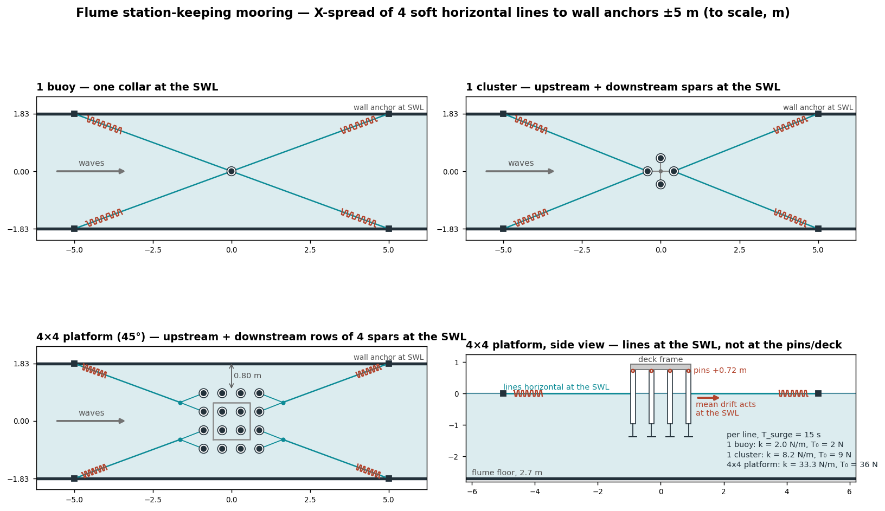
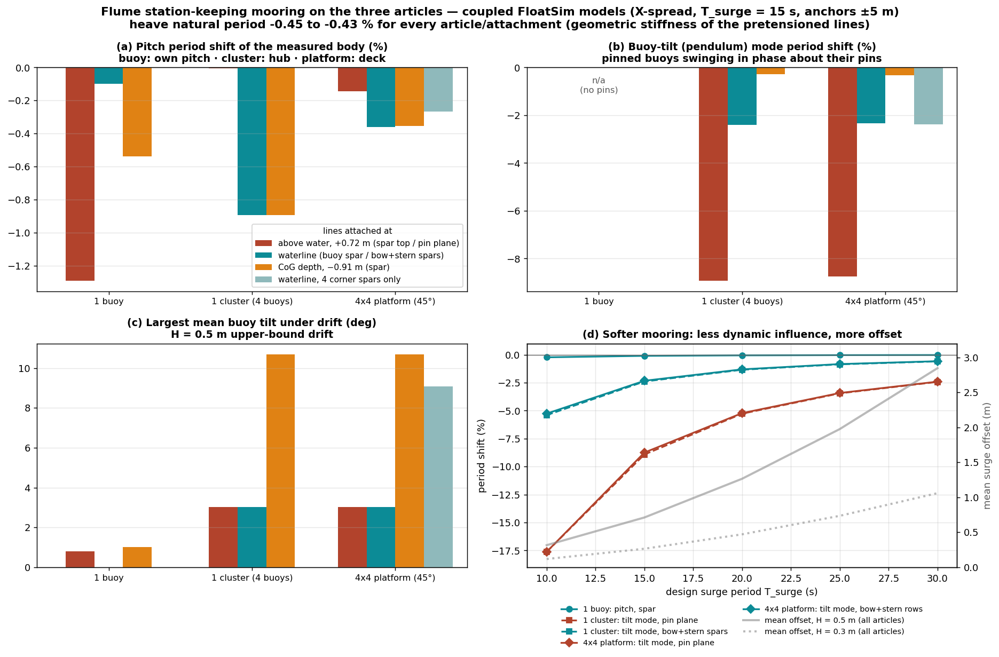
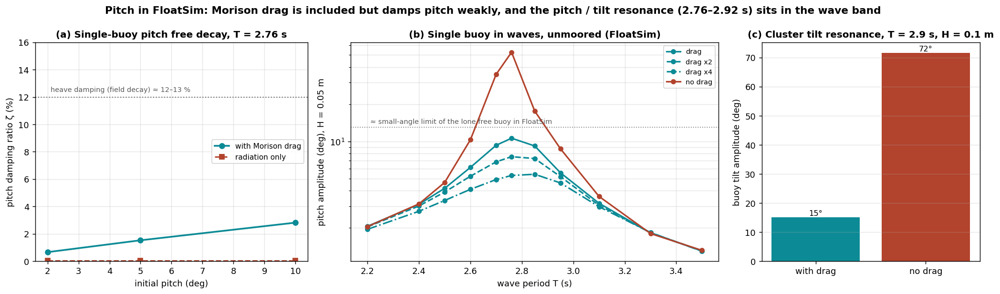

# Flume station-keeping mooring — 1 buoy, 1 cluster, 4×4 platform (OSU LWF)

TEAMER reviewer question: *which mooring do we need, and how could the flume size influence it?*

Scope agreed for the answer: the flume mooring is **station-keeping only** (hold the article in
the test section without disturbing the measured wave-frequency response); the field site is
**deep water**; test waves are moderate, **H = 0.2–0.5 m**, T = 1.4–4.0 s. Flume: OSU Large Wave
Flume, 3.66 m wide, 2.7 m deep, 104 m long. The cluster and the platform are tested at the
**45° orientation**: square to the flume, with a flat side of two (cluster) or four (platform)
buoys facing the waves.

Deliverables:
- [`RESPONSE-mooring.md`](RESPONSE-mooring.md): the reviewer response text.
- `Flume_mooring_technical.pptx`: a 12-slide technical deck (`make_mooring_ppt.py`).
- [`HWRL-questions.md`](HWRL-questions.md): open facility questions for OSU.
- `mooring_motion.html`: interactive 3D motion viewer of the three moored articles in the flume
  (`build_mooring_viewer.py`; see "Motion viewer" below).

## Status: FloatSim re-check (2026-09-23)

Every motion result below now comes from **FloatSim itself**:
- the deck bodies and Capytaine BEM go through the driver;
- drag is the deck's Morison elements;
- the mooring is four FloatSim `Catenary` lines per article;
- integration is `integrate_cummins` under `make_regular_wave_force`.

The decks are in `floatsim_decks.py`. The re-check changed three things.

1. **The single-buoy pitch period is 2.76 s, not 2.12 s.**
   - The earlier single-buoy study code (`osu_buoy_common.build_lhs`) assembled the buoy about
     the waterline and added the gravity term on top. That gave C55 = 265 N·m/rad instead of
     FloatSim's 70.8 N·m/rad (hand check 73.9).
   - The deck convention is reference point = CoG = BEM origin.
   - Heave is unaffected (2.57 s).
   - The articulated models (cluster, platform) were already consistent.
   - The single-buoy rows of `mooring_verify.py` inherit the bug and are **invalid**.
2. **The moving-body drift refinement (`drift_td.py`, `drift_refined.py`) is withdrawn.**
   - It is custom code that carried the same single-buoy bug.
   - Its wave-relative drag also passed body-relative positions for the articulated bodies.
   - The design stays on the fixed-body drift bound, as before.
3. **The line pretension tilts the pinned buoys (cluster, platform).**
   - Each moored spar is pulled outward by its line at the SWL, 0.72 m below its pin. The
     pretension therefore tilts that buoy about its pin before any wave or drift acts.
   - FloatSim's settled moored equilibrium (`moored_equilibrium.json`) gives
     **4.9° for the cluster's four buoys** and **9.1° for the platform's eight moored spars**.
     The platform's eight unmoored inner buoys stay level.
   - The single buoy is unaffected: its four lines balance on one collar.
   - `mooring_verify.py` modelled the lines as linear springs, with no pretension moment. Its
     "0° trim" and "the cluster's buoys do not tilt" results are therefore **superseded**, and
     so is the SWL-spar attachment it recommended for the pinned articles.
   - The fix (attach at the pin plane, balance the pretension on each spar, or reduce T₀) is a
     design decision still open.

Still valid: the sizing (`mooring_sizing.py`), which covers inertia, drift bound, X-spread
design and the flume-size section. It uses no motion simulation.

## Answer

> The sizing below stands. The attachment and tilt rows for the pinned articles, and the
> single-buoy pitch row, are superseded; see **Status** above.

An **X-spread of four soft, horizontal lines at the still-water line (SWL)** to wall anchors 5 m
up- and downstream, sized for a **surge natural period of ~15 s** (≥ 3.75× the longest wave
period). Where the lines attach matters more than how stiff they are:

| | 1 buoy | 1 cluster (4 buoys, 45°) | 4×4 platform (45°) |
|---|---|---|---|
| Lines attach at | one collar on the spar at the SWL | its 4 spars at the SWL, one line each | upstream + downstream rows (8 spars, 2-leg bridles), at the SWL |
| Horizontal inertia M + A₁₁ | 40.4 kg | 166.9 kg | 668.9 kg |
| Surge stiffness Kx | 7.1 N/m | 29.3 N/m | 117.4 N/m |
| Per line: stiffness / pretension / max tension | 2.0 N/m / 2.2 N / 4.1 N | 8.3 N/m / 9.0 N / 16.5 N | 33.3 N/m / 36 N / 66 N |
| Spring pre-stretch / max stretch | 1.1 m / 2.0 m | 1.1 m / 2.0 m | 1.1 m / 2.0 m |
| Moored surge period (coupled model) | 15.0 s | 15.4 s | 15.8 s |
| Heave natural period shift | −0.43 % | −0.45 % | −0.45 % |
| Pitch period shift (buoy / hub / deck) | −0.10 % | −0.45 % | −0.36 % |
| Buoy-tilt (pendulum) mode shift | n/a | −2.4 % | −2.3 % |
| Mean drift, H = 0.5 m (upper bound) | 5.2 N | 20.9 N | 83.6 N |
| Mean offset, H = 0.5 m / 0.3 m | 0.74 / 0.27 m | 0.71 / 0.27 m | 0.75 / 0.28 m |
| Mean trim / largest buoy tilt, H = 0.5 m | 0° / — | 0° / 0.0° | 0° / 3.0° |

- **The platform's 3.0° buoy tilt** (1.1° at H = 0.3 m) is **not caused by the mooring**. The
  drift acts at each spar's SWL, 0.72 m below its pin, so every unmoored inner buoy leans by that
  amount whatever holds the deck.
- **The cluster's buoys do not tilt at all.** All four spars are moored at their own SWL, so each
  reacts its own drift where it acts.
- **One design, scaled by buoy count.** The numbers are nearly identical across the articles
  because inertia and drift both scale with the number of buoys. Per-line stiffness and
  pretension are ×4.1 for the cluster and ×16.6 for the platform.



## Where to attach: at the SWL, not at the pins/deck, and not only at the corners

> **Superseded for the pinned articles.** This section comes from `mooring_verify.py`, a
> linear-spring check with no line pretension moment. FloatSim's catenaries show the SWL-spar
> attachment tilting the moored buoys by the pretension alone. See **Status** above.

`mooring_verify.py` adds the mooring to the real FloatSim models: the 6-DOF buoy, the 30-DOF
cluster (4 buoys + hub, pinned KKT joints) and the 126-DOF platform (16 buoys + 4 hubs + deck).
For each attachment option it computes how the natural periods shift and the static equilibrium
under the drift.



- **The drift acts at the SWL**, because it is splash-zone drag. Lines at the SWL react it with
  no lever arm, and the trim is zero for all three articles.
- **Single buoy.** The SWL collar gives −0.1 % pitch period and 0° trim. The spar top (+0.72 m)
  gives −1.3 % and 0.8°; CoG depth (−0.91 m) gives −0.5 % and 1.0°.
- **Pinned articles, pin plane (hub / deck, +0.72 m).** Zero trim, since the pins transmit no
  moment. But it holds the light deck/hubs (14 kg against 669 kg of platform) nearly still. That
  stiffens the **buoy-tilt mode** by **−8.8 to −9.0 %** at T_surge = 15 s. This is the buoys
  swinging in phase about their pins, at 2.86 s (cluster) and 2.92 s (platform), inside the wave
  band.
- **Pinned articles, spars at the SWL (recommended).**
  - Cluster: its 4 spars, one line each. The tilt-mode shift is −2.4 %, the hub pitch −0.45 %,
    and there is no buoy tilt.
  - Platform: the upstream and downstream rows of 4 spars. The attached buoys lean the other way
    by the same 3.0°, so the largest buoy tilt is unchanged. The tilt mode shifts −2.3 % and deck
    pitch −0.4 %.
- **Not recommended:**
  - only the 4 corner spars of the platform: the whole array's drift passes through four pins,
    giving a **9.1° corner-buoy tilt**;
  - attaching below the SWL (CoG depth): up to **10.7° buoy tilt**.

## How soft

Panel (d) of the figure sweeps the design surge period for the finalists (platform values shown;
the cluster's are within 0.3 %):

| T_surge | 10 s | 15 s | 20 s | 25 s | 30 s |
|---|---|---|---|---|---|
| Tilt-mode shift, spars at SWL | −5.3 % | −2.3 % | −1.3 % | −0.8 % | −0.6 % |
| Tilt-mode shift, pin plane | −17.6 % | −8.8 % | −5.2 % | −3.4 % | −2.4 % |
| Mean offset, H = 0.5 m (upper bound) | 0.35 m | 0.75 m | 1.30 m | 2.0 m | 2.9 m |
| Spring max stretch | — | 2.0 m | 3.1–3.2 m | — | — |

**15 s** is the recommended compromise: every shift is ≤ 2.4 %, the offset is < 0.8 m, and the
springs need 2 m of linear stroke. 20 s halves the tilt-mode shift, at the cost of a 1.3 m
offset and 3.2 m of stroke. A single-point bridle at the pin plane would need **≥ 25 s** to reach
the same (−3.4 %), with a 2 m offset.

## Motion viewer

`mooring_motion.html` plays back each article in the flume in a regular wave, H = 0.1 m, at
T = 2.2, 2.9 and 3.5 s, **with and without the mooring** (the "Mooring on / off" control). It is
built with the FloatSim motion-viewer renderer
(`../platform-12buoy/fin_study/platform_motion.html`), extended in
`mooring_motion_template.html` with:
- the flume walls and floor;
- the wall anchors;
- the mooring lines, coloured by live tension;
- the true spar and heave-plate geometry.

- **All motion is FloatSim output.**
  - Decks come from `floatsim_decks.py`. The frames are FloatSim's own state over the last two
    wave periods of the settled run, decimated and not refitted.
  - Line tension is the magnitude of each FloatSim catenary's force at that frame's pose.
  - Displacements are measured from FloatSim's **unmoored** equilibrium, so a moored run shows
    what the lines do, including the static pretension tilt ("static" in the tilt readout).
- **H = 0.1 m keeps the resonant buoy tilt inside FloatSim's small-angle range.** At larger H
  near resonance, the lone free buoy's yaw goes numerically unstable once pitch passes ~13°:
  small-angle kinematics, spar drag, and no yaw restraint.
- **The mean drift offset is not in the model.** Its upper bound is shown as a readout.

| FloatSim, H = 0.1 m: heave RAO / peak buoy tilt | T = 2.2 s | T = 2.9 s | T = 3.5 s |
|---|---|---|---|
| 1 buoy, moored | 0.73 / 4.7° | 1.42 / 10.6° | 1.23 / 2.8° |
| 1 buoy, free | 0.72 / 4.1° | 1.45 / 12.7° | 1.25 / 2.7° |
| 1 cluster, moored | 0.66 / 8.5° (static 4.9°) | 1.56 / 17.2° (static 4.9°) | 1.25 / 7.6° (static 4.9°) |
| 1 cluster, free | 0.66 / 3.2° | 1.58 / 15.3° | 1.26 / 3.0° |
| 4×4 platform, moored | 0.55 / 12.0° (static 9.1°) | 1.51 / 23.0° (static 9.1°) | run failed (catenary solver) |
| 4×4 platform, free | 0.57 / 2.6° | 1.61 / 14.7° | 1.25 / 3.0° |

Heave RAO is at the buoy's SWL (1 buoy), the hub (cluster) or the deck centre (platform). Peak tilt is the largest buoy tilt over the loop, measured from the unmoored equilibrium.

```bash
python build_mooring_viewer.py run buoy 2.2,2.9,3.5 --H 0.1          # seconds per period
python build_mooring_viewer.py run buoy 2.2,2.9,3.5 --H 0.1 --free   # the same, unmoored
python build_mooring_viewer.py run cluster 2.2,2.9,3.5 --H 0.1       # ~1 min per period
python build_mooring_viewer.py run platform 2.9 --H 0.1              # ~7 min; periods in parallel
python build_mooring_viewer.py html                                  # -> mooring_motion.html
```

The first moored cluster or platform run settles FloatSim's moored equilibrium and caches it in
`moored_equilibrium.json`: about 2 min for the cluster, ~20 min for the platform. See
"FloatSim limitations" for why.

## Why the buoys pitch so much near resonance

`pitch_check.py` (all FloatSim) shows the large resonant pitch is the model's physics, not a
missing term.



- **Morison drag is in the model**, on the spar (10 segments, Cd 1.2) and on the heave plate
  (normal Cd 5, edge Cd 1.5). It is FloatSim's calm-water drag on the body velocity.
- **The drag damps pitch weakly.**
  - Single-buoy pitch free decay (T = 2.76 s): ζ = 0.66 % at 2°, 1.53 % at 5°, 2.82 % at 10°.
    Radiation alone gives 0.03 %.
  - Heave, by contrast, has ζ ≈ 12–13 % (field decay).
  - The buoy rotates near its CoG, so the spar there barely moves. The heave plate moves
    edgewise in pitch, presenting its 4 mm edge, and its face drag acts on a lever of only its
    0.14 m radius.
- **The pitch resonances sit in the wave band:** 2.76 s for the single buoy, 2.86–2.92 s for the
  pinned buoys' tilt mode.
  - Single buoy, H = 0.05 m (unmoored): resonant pitch **10.6°**, 14× the wave slope.
  - Every Cd ×2 gives 7.5°; ×4 gives 5.4°; without drag, 53°.
  - Off resonance (≤ 2.4 s or ≥ 3.1 s), drag barely matters.
- **Cluster** (T = 2.9 s, H = 0.1 m): buoy tilt 15° with drag, 72° without.
- **The mooring is not the cause.** Moored and free runs pitch alike (viewer table above).
- **What the model leaves out (all would add damping):**
  - the real perforated, webbed plate and its frame;
  - gimbal/pin friction;
  - instrumentation;
  - wave-relative drag (the driver's drag is calm-water).

  The absolute pitch damping has never been measured. A pitch / tilt free decay on one buoy
  in the tank would pin it down.
- **For the test plan:** expect large pitch near 2.5–3.0 s for every article. Cap H there, or
  check the gimbal range.

## FloatSim limitations found (core fixes need approval)

1. **The per-body kernel has no small-body override.** A one-body database takes the per-body
   path, and its asymptote gate cannot be passed by a 1.7 m buoy. The override exists only on
   the coupled path. `floatsim_decks.build_single` reuses the driver's per-body functions and
   passes the override.
2. **The catenary anchor frame.** `make_catenary_state_force` puts the fairlead at displacement
   + arm, which is absolute only for a reference point at the origin. The anchors are given
   relative to each body's reference point.
3. **The static equilibrium ignores joints.** `solve_static_equilibrium` solves C·ξ = F body by
   body, so a line pull balanced only through a pin sends hybr into a slack catenary.
   `floatsim_decks.moored_equilibrium` lets the constrained integrator settle instead, and gates
   the result on the joint-projected residual ≤ `_EQUILIBRIUM_TOL_N`.
4. **The lone free buoy is unstable in yaw above ~13° of pitch** (small-angle kinematics, spar
   drag, Izz = 0.063 kg·m², no yaw restraint). Pinned buoys are yaw-locked and immune.
5. **The driver's Morison drag is calm-water only.**
6. **The catenary solver cold-starts.** `solve_catenary` runs one `scipy.root(hybr)` from
   H = V_A = 1 N, with no warm start or retry.
   - The moored platform run at T = 3.5 s stopped at t = 25.7 s. Buoy7's line failed to solve
     while buoy10's mirror-image line, with geometry equal to 10 significant figures, solved at
     16.1 N (29 % strain, nearly horizontal).
   - That makes it a solver-robustness failure, not a physical one. These spring lines are very
     elastic (EA ≈ 52–55 N against 16–18 N of tension), far from the solver's starting guess.
   - The viewer shows that case free-floating only, and says why.

## How the flume size influences the mooring

**Depth (2.7 m).**
- A deep-water field mooring cannot be reproduced at scale. The flume mooring is an *equivalent*
  soft station-keeping system. It is characterised by a static pull test and included in the
  numerical model of the test.
- The lines must be horizontal, to anchors at the SWL. With 5 m of scope, a line from the SWL to
  a floor anchor would be inclined 27°. That adds vertical stiffness ≈ 0.29 Kx and pulls the
  article down (platform: ≈ 65 N, ≈ 2 cm of draft). With 10 m of scope the figures are 15° and
  0.07 Kx: workable, but inferior.
- Depth raises the orbital velocity at long periods. Compared with deep water, the drift is ×1.29
  at 3 s and ×1.87 at 4 s. The design drift, however, peaks at the steepness limit near 2.2 s,
  where the factor is only 1.05. **Depth does not drive the mooring design.**

**Width (3.66 m).**
- The width sets the X-spread angle: 20° with ±5 m anchors. Sway stiffness is therefore about ⅓
  of surge, giving a sway period of ≈ 26 s.
- A lateral disturbance of 10 % of the drift moves the article 0.21 m. The clearance to the walls
  is 1.69 m (buoy), 1.39 m (cluster) and **0.80 m (platform)**.
- Longer anchors (±10 m) halve the heave coupling (−0.22 % instead of −0.43 %), but they raise
  the lateral excursion to 0.49 m, which is too close to the platform's 0.80 m. **The width is
  what fixes the platform's anchors at ~±5 m.** The buoy and cluster can use either distance.

**Length (104 m).** Mean offsets ≤ 0.75 m (upper bound) and a ±5.3 m line footprint fit easily.
Wave gauges are referenced to the mean moored position.

## Method

- **`mooring_sizing.py`**: horizontal inertia (structural mass + BEM low-frequency surge added
  mass: 18.87 kg per single buoy, 78.8 kg for the cluster, 310.6 kg for the 16-buoy array) and
  the mean-drift upper bound.
  - The drift is splash-zone Morison drag on every fixed spar,
    `F = (2/3π) ρ Cd D A U²` with `U = Aω coth(kh)`, plus the Havelock potential bound. It
    assumes no shielding and caps the waves at H/L ≤ 1/15.
  - The same script designs the X-spread: per-line axial stiffness, a pretension that keeps the
    slack side taut (+20 %), sway stiffness, and the heave geometric stiffness 4T₀/ℓ.
- **`bem_cluster.py`**: coupled Capytaine BEM of the 4-buoy cluster at 45° (1248 panels, 24 DOF,
  deep water, PSD-projected damping), matching the platform's hull, mesh and schema.
- **`mooring_verify.py`**: the mooring enters as an anisotropic point stiffness
  `BᵀKB`, `B = [I, −skew(r)]`, `K = diag(Kx, Ky, Kz_geo)`. (The deck `LinearSpring` is isotropic
  and would wrongly add Kx to heave.)
  - Natural periods come from the constrained generalized eigenproblem on the null space of the
    joint Jacobian, iterated on A(ω). Each mode is identified unmoored and tracked into the moored
    model by mass-weighted MAC (≥ 0.9). Heave uses the rigid-heave Rayleigh quotient, which is
    robust to the platform's near-degenerate heave-like modes.
  - The static drift response is a KKT solve `[K Gᵀ; G 0]`.
- **`floatsim_decks.py`**: the FloatSim decks of the three articles, moored (FloatSim
  `Catenary` lines) or free, and the build / wave-run helpers. `pitch_check.py` and
  `build_mooring_viewer.py` run on it.
- **`bem_cluster.py single`**: the single-buoy Capytaine BEM on the same hull, mesh and pipeline
  (`single_osu_open(_psd).nc`, about the CoG).
- **Withdrawn**: `drift_td.py` / `drift_refined.py` (moving-body drift) and the single-buoy
  rows of `mooring_verify.py`. See Status.
- **`mooring_layout.py`**: the line design table (`mooring_design_table.csv`) and the schematic.
- **`make_mooring_ppt.py`**: the technical deck. It reads every number from the CSVs above.

## Limits

- **The design drift is an upper bound** (fixed bodies, no shielding, Cd = 1.2). It is applied
  in both directions. Load cells on the lines will measure the true mean drift.
- **The coupled check is linear:** eigen-analysis plus static equilibrium. Regular waves produce
  only a mean drift. Irregular waves would add slow drift near T_surge, a fraction of the mean
  offset.
- **The coupled BEM is deep water**, as at the field site. The flume-depth effect on the
  hydrodynamics is quantified in `../platform-12buoy/flume-wall-effect/`.
- **The springs must stay linear over ~2 m of stretch**, and the bridle legs must be equal so
  that the 8 platform spars share the load. Verify both with a static pull test before testing.

## Reproduce

```bash
python mooring_sizing.py    # drift + stiffness window + X-spread line design
python bem_cluster.py       # 45-deg cluster BEM (~1 min); writes cluster_osu_open_rot45(_psd).nc
python mooring_verify.py    # coupled check on the 3 articles + T_surge sweep (~2 min)
python mooring_layout.py    # design table + layout schematic
python bem_cluster.py single  # single-buoy BEM (~20 s); writes single_osu_open(_psd).nc
python pitch_check.py       # FloatSim pitch decay + forced sweep (~10 min)
python make_mooring_ppt.py  # Flume_mooring_technical.pptx
```

The platform's coupled BEM (`coupled_osu_open_rot45_psd.nc`) comes from
`../platform-12buoy/flume-wall-effect/`.
