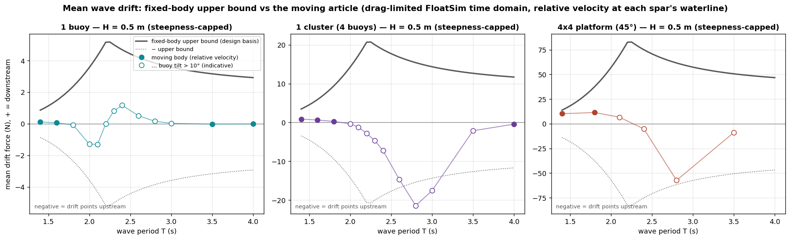

# Flume station-keeping mooring — 1 buoy, 1 cluster, 4×4 platform (OSU LWF)

TEAMER reviewer question: *which mooring do we need, and how could the flume size influence it?*

Scope agreed for the answer: the flume mooring is **station-keeping only** (hold the article in
the test section without disturbing the measured wave-frequency response); the field site is
**deep water**; test waves are moderate, **H = 0.2–0.5 m**, T = 1.4–4.0 s. Flume: OSU Large Wave
Flume, 3.66 m wide, 2.7 m deep, 104 m long. The cluster and the platform are tested at the
**45° orientation**: square to the flume, with a flat side of two (cluster) or four (platform)
buoys facing the waves.

Deliverables:
- [`RESPONSE-mooring.md`](RESPONSE-mooring.md): the reviewer response text.
- `Flume_mooring_technical.pptx`: a 12-slide technical deck (`make_mooring_ppt.py`).
- [`HWRL-questions.md`](HWRL-questions.md): open facility questions for OSU.
- `mooring_motion.html`: interactive 3D motion viewer of the three moored articles in the flume
  (`build_mooring_viewer.py`; see "Motion viewer" below).

## Answer

An **X-spread of four soft, horizontal lines at the still-water line (SWL)** to wall anchors 5 m
up- and downstream, sized for a **surge natural period of ~15 s** (≥ 3.75× the longest wave
period). Where the lines attach matters more than how stiff they are:

| | 1 buoy | 1 cluster (4 buoys, 45°) | 4×4 platform (45°) |
|---|---|---|---|
| Lines attach at | one collar on the spar at the SWL | its 4 spars at the SWL, one line each | upstream + downstream rows (8 spars, 2-leg bridles), at the SWL |
| Horizontal inertia M + A₁₁ | 40.4 kg | 166.9 kg | 668.9 kg |
| Surge stiffness Kx | 7.1 N/m | 29.3 N/m | 117.4 N/m |
| Per line: stiffness / pretension / max tension | 2.0 N/m / 2.2 N / 4.1 N | 8.3 N/m / 9.0 N / 16.5 N | 33.3 N/m / 36 N / 66 N |
| Spring pre-stretch / max stretch | 1.1 m / 2.0 m | 1.1 m / 2.0 m | 1.1 m / 2.0 m |
| Moored surge period (coupled model) | 15.0 s | 15.4 s | 15.8 s |
| Heave natural period shift | −0.43 % | −0.45 % | −0.45 % |
| Pitch period shift (buoy / hub / deck) | −0.10 % | −0.45 % | −0.36 % |
| Buoy-tilt (pendulum) mode shift | n/a | −2.4 % | −2.3 % |
| Mean drift, H = 0.5 m (upper bound) | 5.2 N | 20.9 N | 83.6 N |
| Mean offset, H = 0.5 m / 0.3 m | 0.74 / 0.27 m | 0.71 / 0.27 m | 0.75 / 0.28 m |
| Mean trim / largest buoy tilt, H = 0.5 m | 0° / — | 0° / 0.0° | 0° / 3.0° |

- **The platform's 3.0° buoy tilt** (1.1° at H = 0.3 m) is **not caused by the mooring**. The
  drift acts at each spar's SWL, 0.72 m below its pin, so every unmoored inner buoy leans by that
  amount whatever holds the deck.
- **The cluster's buoys do not tilt at all.** All four spars are moored at their own SWL, so each
  reacts its own drift where it acts.
- **One design, scaled by buoy count.** The numbers are nearly identical across the articles
  because inertia and drift both scale with the number of buoys. Per-line stiffness and
  pretension are ×4.1 for the cluster and ×16.6 for the platform.


## Where to attach: at the SWL, not at the pins/deck, and not only at the corners

`mooring_verify.py` adds the mooring to the real FloatSim models: the 6-DOF buoy, the 30-DOF
cluster (4 buoys + hub, pinned KKT joints) and the 126-DOF platform (16 buoys + 4 hubs + deck).
For each attachment option it computes how the natural periods shift and the static equilibrium
under the drift.


- **The drift acts at the SWL**, because it is splash-zone drag. Lines at the SWL react it with
  no lever arm, and the trim is zero for all three articles.
- **Single buoy.** The SWL collar gives −0.1 % pitch period and 0° trim. The spar top (+0.72 m)
  gives −1.3 % and 0.8°; CoG depth (−0.91 m) gives −0.5 % and 1.0°.
- **Pinned articles, pin plane (hub / deck, +0.72 m).** Zero trim, since the pins transmit no
  moment. But it holds the light deck/hubs (14 kg against 669 kg of platform) nearly still. That
  stiffens the **buoy-tilt mode** by **−8.8 to −9.0 %** at T_surge = 15 s. This is the buoys
  swinging in phase about their pins, at 2.86 s (cluster) and 2.92 s (platform), inside the wave
  band.
- **Pinned articles, spars at the SWL (recommended).**
  - Cluster: its 4 spars, one line each. The tilt-mode shift is −2.4 %, the hub pitch −0.45 %,
    and there is no buoy tilt.
  - Platform: the upstream and downstream rows of 4 spars. The attached buoys lean the other way
    by the same 3.0°, so the largest buoy tilt is unchanged. The tilt mode shifts −2.3 % and deck
    pitch −0.4 %.
- **Not recommended:**
  - only the 4 corner spars of the platform: the whole array's drift passes through four pins,
    giving a **9.1° corner-buoy tilt**;
  - attaching below the SWL (CoG depth): up to **10.7° buoy tilt**.

## How soft

Panel (d) of the figure sweeps the design surge period for the finalists (platform values shown;
the cluster's are within 0.3 %):

| T_surge | 10 s | 15 s | 20 s | 25 s | 30 s |
|---|---|---|---|---|---|
| Tilt-mode shift, spars at SWL | −5.3 % | −2.3 % | −1.3 % | −0.8 % | −0.6 % |
| Tilt-mode shift, pin plane | −17.6 % | −8.8 % | −5.2 % | −3.4 % | −2.4 % |
| Mean offset, H = 0.5 m (upper bound) | 0.35 m | 0.75 m | 1.30 m | 2.0 m | 2.9 m |
| Spring max stretch | — | 2.0 m | 3.1–3.2 m | — | — |

**15 s** is the recommended compromise: every shift is ≤ 2.4 %, the offset is < 0.8 m, and the
springs need 2 m of linear stroke. 20 s halves the tilt-mode shift, at the cost of a 1.3 m
offset and 3.2 m of stroke. A single-point bridle at the pin plane would need **≥ 25 s** to reach
the same (−3.4 %), with a 2 m offset.

## Refinement: the drift on a moving article

The design drift assumes each spar is **held fixed**. The real articles move with the waves, so
`drift_td.py` recomputes the splash-zone drift from each spar's motion relative to the water:
`F = ½ ρ Cd D ⟨η_r |u_r| u_r⟩` at the spar waterline, with relative elevation η_r and relative
velocity u_r.

- The motion comes from drag-limited FloatSim time-domain runs: the linear BEM excitation and
  radiation, Morison drag on the spar and plate **relative to the Airy wave velocity**, and the
  design mooring. The driver's own drag is calm-water, so the same drag elements are rebuilt
  with wave kinematics.
- Each case is run at H = 0.5 m, steepness-capped. The resulting ratio to the fixed-body value
  is applied to the flume-depth bound (`drift_refined.py`).



| | Design bound | Moving body, model valid (tilt ≤ 10°) | Moving body, largest (any tilt) |
|---|---|---|---|
| 1 buoy | 5.2 N | ≤ 0.1 N | −1.3 N (upstream, 2.0–2.1 s) |
| 1 cluster | 20.9 N | ≤ 0.9 N | −21.4 N (upstream, 2.8 s) |
| 4×4 platform | 83.6 N | ≤ 11.4 N (1.4–1.8 s) | −57.4 N (upstream, 2.8 s) |

- **Away from the buoys' own resonances, the articles move with the water.** Their drift is a
  small fraction of the bound. In the shortest waves the platform barely moves, so its drift
  there approaches the fixed-body value for those periods, which is still ≤ 14 % of the design
  bound.
- **Near the pitch resonance (single buoy, 2.0–2.1 s) and the pinned buoys' tilt resonance
  (2.6–3.0 s), the mean drift reverses and points upstream.** For the cluster it reaches about
  the bound's magnitude.
  - Those cases involve 30–56° buoy tilts, beyond the small-angle validity of the linear
    joint/hydrostatic model, so the magnitudes there are **indicative**.
  - The **design therefore stays on the bound, in both directions**. The symmetric X-spread
    keeps the slack-side lines taut for the same offset up- or downstream.
- **Test-matrix note (not a mooring issue).** In 0.5 m waves at 2.6–3.0 s, the model predicts
  the pinned buoys tilting 30°+. Check the gimbal range, or cap H near those periods.

## Motion viewer

`mooring_motion.html` plays back the moored response of each article in the flume, using the
FloatSim motion-viewer renderer (`../platform-12buoy/fin_study/platform_motion.html`).
`mooring_motion_template.html` extends that renderer with:
- the flume walls and floor, and the wall anchors;
- the four mooring lines, each with its spring, **coloured by live line tension**;
- the true spar and heave-plate geometry;
- a free single buoy and the hub-only cluster.

Cases: H = 0.3 m at T = 2.2, 2.8 and 3.5 s for each article.
- The motion comes from `drift_td.simulate()`: drag-limited time domain, Morison drag relative
  to the wave velocity, and the design mooring.
- Each settled response is fitted with harmonics 1–3, so it loops over one period.
- Line tension = pretension + line stiffness × stretch of each attachment.
- Motion is shown at true scale by default.
- The mean drift offset is not part of the time-domain model; its upper bound is shown as a
  readout.
- Cases with buoy tilts above 10° are flagged in the viewer as beyond the small-angle range.

```bash
python build_mooring_viewer.py run buoy          # seconds
python build_mooring_viewer.py run cluster       # ~1 min per period
python build_mooring_viewer.py run platform 2.8  # ~8 min per period; run periods in parallel
python build_mooring_viewer.py html              # -> mooring_motion.html
```

## How the flume size influences the mooring

**Depth (2.7 m).**
- A deep-water field mooring cannot be reproduced at scale. The flume mooring is an *equivalent*
  soft station-keeping system. It is characterised by a static pull test and included in the
  numerical model of the test.
- The lines must be horizontal, to anchors at the SWL. With 5 m of scope, a line from the SWL to
  a floor anchor would be inclined 27°. That adds vertical stiffness ≈ 0.29 Kx and pulls the
  article down (platform: ≈ 65 N, ≈ 2 cm of draft). With 10 m of scope the figures are 15° and
  0.07 Kx: workable, but inferior.
- Depth raises the orbital velocity at long periods. Compared with deep water, the drift is ×1.29
  at 3 s and ×1.87 at 4 s. The design drift, however, peaks at the steepness limit near 2.2 s,
  where the factor is only 1.05. **Depth does not drive the mooring design.**

**Width (3.66 m).**
- The width sets the X-spread angle: 20° with ±5 m anchors. Sway stiffness is therefore about ⅓
  of surge, giving a sway period of ≈ 26 s.
- A lateral disturbance of 10 % of the drift moves the article 0.21 m. The clearance to the walls
  is 1.69 m (buoy), 1.39 m (cluster) and **0.80 m (platform)**.
- Longer anchors (±10 m) halve the heave coupling (−0.22 % instead of −0.43 %), but they raise
  the lateral excursion to 0.49 m, which is too close to the platform's 0.80 m. **The width is
  what fixes the platform's anchors at ~±5 m.** The buoy and cluster can use either distance.

**Length (104 m).** Mean offsets ≤ 0.75 m (upper bound) and a ±5.3 m line footprint fit easily.
Wave gauges are referenced to the mean moored position.

## Method

- **`mooring_sizing.py`**: horizontal inertia (structural mass + BEM low-frequency surge added
  mass: 18.87 kg per single buoy, 78.8 kg for the cluster, 310.6 kg for the 16-buoy array) and
  the mean-drift upper bound.
  - The drift is splash-zone Morison drag on every fixed spar,
    `F = (2/3π) ρ Cd D A U²` with `U = Aω coth(kh)`, plus the Havelock potential bound. It
    assumes no shielding and caps the waves at H/L ≤ 1/15.
  - The same script designs the X-spread: per-line axial stiffness, a pretension that keeps the
    slack side taut (+20 %), sway stiffness, and the heave geometric stiffness 4T₀/ℓ.
- **`bem_cluster.py`**: coupled Capytaine BEM of the 4-buoy cluster at 45° (1248 panels, 24 DOF,
  deep water, PSD-projected damping), matching the platform's hull, mesh and schema.
- **`mooring_verify.py`**: the mooring enters as an anisotropic point stiffness
  `BᵀKB`, `B = [I, −skew(r)]`, `K = diag(Kx, Ky, Kz_geo)`. (The deck `LinearSpring` is isotropic
  and would wrongly add Kx to heave.)
  - Natural periods come from the constrained generalized eigenproblem on the null space of the
    joint Jacobian, iterated on A(ω). Each mode is identified unmoored and tracked into the moored
    model by mass-weighted MAC (≥ 0.9). Heave uses the rigid-heave Rayleigh quotient, which is
    robust to the platform's near-degenerate heave-like modes.
  - The static drift response is a KKT solve `[K Gᵀ; G 0]`.
- **`drift_td.py` / `drift_refined.py`**: the moving-body drift described above. Each buoy's
  drag yaw moment is zeroed. It is physically nil for an axisymmetric spar and disc, but on the
  buoy's tiny yaw inertia it makes the explicitly lagged drag force numerically unstable.
- **`mooring_layout.py`**: the line design table (`mooring_design_table.csv`) and the schematic.
- **`make_mooring_ppt.py`**: the technical deck. It reads every number from the CSVs above.

## Limits

- **The design drift is an upper bound** off resonance (fixed bodies, no shielding,
  Cd = 1.2). Near the buoys' resonances the moving-body drift can reverse and approach it in
  magnitude, so the bound is kept, in both directions. Load cells on the lines will measure
  the true mean drift.
- **The coupled check is linear:** eigen-analysis plus static equilibrium. Regular waves produce
  only a mean drift. Irregular waves would add slow drift near T_surge, a fraction of the mean
  offset.
- **The coupled BEM is deep water**, as at the field site. The flume-depth effect on the
  hydrodynamics is quantified in `../platform-12buoy/flume-wall-effect/`.
- **The springs must stay linear over ~2 m of stretch**, and the bridle legs must be equal so
  that the 8 platform spars share the load. Verify both with a static pull test before testing.

## Reproduce

```bash
python mooring_sizing.py    # drift + stiffness window + X-spread line design
python bem_cluster.py       # 45-deg cluster BEM (~1 min); writes cluster_osu_open_rot45(_psd).nc
python mooring_verify.py    # coupled check on the 3 articles + T_surge sweep (~2 min)
python mooring_layout.py    # design table + layout schematic
python drift_td.py buoy 1.4,1.6,1.8,2.0,2.1,2.2,2.3,2.4,2.6,2.8,3.0,3.5,4.0     # seconds
python drift_td.py cluster 1.4,1.6,1.8,2.0,2.1,2.2,2.3,2.4,2.6,2.8,3.0,3.5,4.0  # ~1 min each
python drift_td.py platform 1.4,1.8,2.1,2.4,2.8,3.5   # ~8 min each; run periods in parallel
python drift_refined.py     # refined drift figure + summary
python make_mooring_ppt.py  # Flume_mooring_technical.pptx
```

The platform's coupled BEM (`coupled_osu_open_rot45_psd.nc`) comes from
`../platform-12buoy/flume-wall-effect/`.
