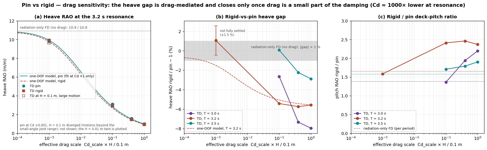

# Articulated (pin) vs whole-chain-rigid 16-buoy platform — results

**Question.** Does the gimbal/pin at the top of each buoy give the platform *better
dynamics* — a stiller, more level deck for launching/landing rockets or hosting
datacenters/hotels — than welding the whole assembly rigid? See `STUDY-PLAN.md`.

**Verdict — the pin wins on every axis that matters.** Same heave, far less deck tilt,
and essentially zero connection moment. The whole-chain weld buys nothing and costs both
tilt and structural load.

## Method
Two configurations off the **same** 16-buoy deck (21 bodies, 126 DOF; same coupled BEM
`capytaine_platform16_fin0215.nc`, hydrostatics, masses, Morison drag, geometry) — only the
joint type differs:
- **articulated** — every joint `yaw_locked` (roll/pitch free): the current design;
- **rigid** — every joint the new `rigid` weld: the 21-body assembly as one rigid raft.

`pvr_common.build_deck(rigid)` swaps the joints via `model_copy`, so the two decks are
byte-identical everywhere else. Two analyses (heading 0°; by the square symmetry pitch@0° =
roll@90°, so pitch characterises the worst-case tilt):
- **`pvr_fd.py`** — constrained frequency-domain saddle solve `[Z Gᵀ; G 0][ξ;λ]=[F;0]` over a
  fine period grid. Gives resonance **placement**, mode **structure**, the platform
  heave/pitch response, and the joint reactions `λ` (connection loads). *Radiation damping
  only* → magnitudes near resonance are upper bounds (a near-undamped internal mode that drag
  suppresses); read it as the **map**.
- **`pvr_td.py`** — the full nonlinear KKT model **with Morison drag** at key periods →
  the **real, drag-limited** deck tilt / heave / accelerations.

## Result 1 — heave is identical (the connection is irrelevant to vertical motion)
Both configs lock the 3 translations, so the platform heaves the same regardless of whether
the buoys can tilt relative to it. FD heave RAO agrees to <0.5% at every period (e.g. 2.37 vs
2.36 at T=3.0 s; 10.9 vs 10.8 at the 3.2 s resonance). **Welding the chain does not improve
heave.**

## Result 2 — deck TILT: the pin is far more level (the headline)
The rigid raft pitches as one body driven by every buoy's wave moment; the articulated
platform lets each gimbal absorb its buoy's tilt, so the deck barely rotates. Rigid pitch RAO
exceeds articulated across the whole band, most strongly in the short, steep operational
waves:

| T (s) | pitch RAO artic (mrad/m) | pitch RAO rigid (mrad/m) | rigid / artic |
|---|---|---|---|
| 2.0 | 30 | 142 | **4.7×** |
| 2.5 | 74 | 322 | **4.3×** |
| 3.0 | 795 | 1101 | 1.4× |
| 3.2 (resonance) | 3946 | 6516 | 1.7× |
| 3.5 | 703 | 1107 | 1.6× |
| 4.0 | 322 | 380 | 1.2× |
| 5.0 | 168 | 162 | ~1.0× |

(FD, radiation-only — magnitudes are upper bounds; the **ratio and direction are robust** and
confirmed drag-limited below.) In the wind-sea band (T ≈ 2–3 s) the rigid deck tilts **4–5×
more**; the two converge only at long swell (T > 5 s) where both bodies follow the wave slope
quasi-statically.

## Result 3 — connection loads: the weld's structural cost
By construction the pin (`yaw_locked`) transmits **no roll/pitch moment** — the buoy→hub joint
moment is **exactly 0** at every period. The rigid weld must carry the full buoy wave moment:
FD peak buoy→hub moment ranges 476 N·m/m (T=2.0 s) down to 27 N·m/m (T=5.0 s), largest in the
same short-period band where it also tilts most. The rigid joints also carry more shear force
(~490 vs 175 N/m off-resonance). **Welding trades a free, load-relieving hinge for a
permanently loaded moment connection** — worse for structure and fatigue.

## Result 4 — drag-limited confirmation (`pvr_td.py`)
Full nonlinear KKT model with Morison drag, H = 0.10 m, heading 0° (all cases settled):

| T (s) | heave RAO artic / rigid | pitch artic (mrad/m) | pitch rigid (mrad/m) | rigid / artic tilt |
|---|---|---|---|---|
| 2.5 | 0.153 / 0.151 | 88.6 | 310.4 | **3.5×** |
| 3.0 | 0.815 / 0.750 | 336.8 | 739.1 | **2.2×** |
| 3.2 | 0.993 / 0.938 | 356.7 | 845.4 | **2.4×** |
| 3.5 | 1.117 / 1.085 | 378.2 | 719.7 | **1.9×** |
| 4.0 | 1.122 / 1.114 | 282.7 | 376.4 | **1.3×** |

This confirms the FD map with *real* amplitudes: **heave is identical** (within a few %; the
3–8 % near-resonance gap is drag-mediated, see the drag-sensitivity addendum below),
and the rigid raft tilts **1.3–3.5× more**, again largest in the short operational waves.
Drag suppresses the FD resonance spike ~11× (articulated pitch at 3.2 s: FD 3946 → drag-limited
357 mrad/m), exactly as the radiation-only caveat predicted — but the **pin/rigid ordering
survives drag**. Peak deck vertical acceleration is similar for both (~0.05–0.23 m/s² over the
band, heave-driven); the discriminator is tilt, where the pin is decisively better. At the
operational T = 2.5 s the articulated deck tilts 88.6 mrad/m (≈5.1°/m of wave amplitude) versus
310 mrad/m (≈17.8°/m) for the rigid raft.

## Caveats
- **FD is radiation-only.** Resonance placement, mode structure and the pin/rigid ordering are
  robust; absolute magnitudes near the 3.2 s resonance are upper bounds (drag-suppressed). The
  drag-limited `pvr_td` values are the real amplitudes.
- **Small-angle joints.** The joint rotational rows are first-order (valid to ~0.1 rad ≈ 6°).
  The articulated buoys tilt more, so a modest wave height (H = 0.10 m) was used; large-amplitude
  response is Phase-2.
- **Placeholder heave-plate hydro** (0.215 m fin, `Cd_n=5`) is common to both configs, so it
  cancels in the comparison; it does not affect the pin-vs-rigid conclusion.
- The rigid raft's pitch resonance sits near the 3.2 s heave resonance — a real design would
  keep the sea's energy band away from it, but that does not rescue the tilt/load penalty away
  from resonance.

## Robustness — the radiation-convolution defect (`pvr_conv_check.py`)
FloatFEA reported a real defect in `RadiationConvolution.evaluate()`: a left-rectangle
convolution over-weights the k=0 lag by `dt·K(0)/2`, inflating applied radiation damping
(~7× in Frobenius norm; ~4× on a bare single-buoy *pitch* free-decay — confirmed
independently). It does **not** change this study. Re-running both configs with a
trapezoid-fixed convolution moves the platform pitch RAO **< 1 %** at every period,
on- and off-resonance:

| T | artic pitch rect → trap | rigid pitch rect → trap | rigid / artic ratio |
|---|---|---|---|
| 2.5 s | 88.6 → 88.6 (1.00×) | 310.4 → 311.1 (1.00×) | 3.50 → 3.51 |
| 3.2 s | 356.7 → 355.5 (1.00×) | 845.4 → 857.3 (1.01×) | 2.37 → 2.41 |

The operational response is **off-resonance / mass-stiffness-controlled — not
damping-controlled at all** (correction per FloatFEA AG2; an earlier draft wrongly said
"drag-controlled"). At T=2.5 s the drag-limited TD pitch (88.6 mrad/m) already sits at the
radiation-only FD value (74): when TD ≈ FD the amplitude is set by `C − ω²(M+A)`, not by any
damping term, so it is insensitive to radiation **and** drag alike — consistent with a ~5×
`Cd` change moving the response only ~1%. That — not drag dominance — is why the ~4×
radiation-damping change is a rounding error here; and the FD map never used the convolution
at all. If anything the fix nudges the rigid/artic ratio *up* (2.37 → 2.41), strengthening
the verdict. The defect is real and should be fixed
in FloatSim (it bites lightly-damped / low-drag / radiation-dominated cases), but it is
independent of this conclusion.

## Addendum — drag sensitivity of the heave gap (`pvr_dragscan.py`)

**Question.** The radiation-only FD gives identical pin/rigid heave (< 1 %). The drag-limited TD
(Result 4) gives a rigid heave 3–8 % lower near resonance. Does the TD converge to the FD as
drag is removed?

**Method.**
- Every Morison Cd (spar, plate normal, plate tangential) is scaled by ×0.4 and ×0.1, then the
  Result 4 runs are repeated (H = 0.10 m; T = 3.0, 3.2, 3.5 s).
- Quadratic drag relative to the linear forces scales with Cd·H. The near-linear limit at the
  3.2 s resonance therefore uses **Cd ×0.01 with H = 0.01 m**. That is the same drag strength as
  Cd ×0.001 at H = 0.1 m, but the motions stay inside the small-angle joint range.
- The x-axis in the figure is the effective drag scale `Cd_scale · H / 0.1 m`.
- The lightly damped resonance settles slowly, so those runs use a 400 s cap and a 0.2 %
  window-to-window settle tolerance (instead of 150 s and 2 %).

Heave RAO, pin / rigid, and the rigid-vs-pin gap (`pvr_dragscan_summary.csv`):

| Effective drag | T = 3.0 s | T = 3.2 s (resonance) | T = 3.5 s |
|---|---|---|---|
| ×1 (Result 4) | 0.81 / 0.75 (−8.0 %) | 0.99 / 0.94 (−5.6 %) | 1.12 / 1.08 (−2.9 %) |
| ×0.4 | 1.23 / 1.14 (−7.3 %) | 1.56 / 1.47 (−5.7 %) | 1.54 / 1.50 (−2.2 %) |
| ×0.1 | 1.94 / 1.89 (−2.6 %) | 3.09 / 2.92 (−5.4 %) | 1.91 / 1.91 (+0.1 %) |
| ×0.001 (Cd ×0.01, H = 0.01 m) | — | 9.81 / 9.91 (+1.1 ± 1.5 %) | — |
| 0 (radiation-only FD) | 2.37 / 2.36 (−0.6 %) | 10.91 / 10.85 (−0.6 %) | 1.99 / 1.99 (0.0 %) |

1. **The gap comes from drag.** In the linear model, uniform heave is decoupled from pitch (the
   platform is symmetric, and all buoys heaving together bends no joint). Drag is the only path
   by which the rigid raft's larger pitch reaches heave: the outer buoys' drag sees `ẇ + x·θ̇`,
   so extra pitch means extra heave damping.
2. **The gap holds steady while drag limits the motion.** Cutting Cd lets both heave and pitch
   grow by about the same factor (×1.6 each from ×1 to ×0.4 at 3.2 s). The pitch-driven share of
   the heave damping therefore stays the same, and the gap barely moves (−5.6 / −5.7 / −5.4 %).
3. **It converges once drag is a small part of the damping.** At the ×0.001 effective scale,
   heave is 90 % of the FD value and the gap is gone: +1.1 %, within ±1.5 % because the amplitude
   was still drifting ~0.5 % per window at the 400 s cap. Off resonance, the response is set by
   mass and stiffness, so the gap already closes at ×0.1.
4. **A one-DOF model explains the slow convergence.** Radiation plus equivalent-linearised drag
   gives `X = X_lin / (1 + c·s·X)`, where c is fitted on the Cd ×1 run only.
   - Model vs TD (pin / rigid): 1.53 / 1.44 vs 1.56 / 1.47 at ×0.4; 2.83 / 2.69 vs 3.09 / 2.92
     at ×0.1; 9.9 / 9.8 vs 9.8 / 9.9 at ×0.001.
   - Drag's share of the resonant heave damping: 91 % at ×1, 74 % at ×0.1, 9 % at ×0.001.
   - The convergence is slow because drag damping ∝ Cd × velocity, and the velocity grows as Cd
     drops. A 10× cut in Cd removes only about √10 of the effective drag damping.
5. **The tilt verdict does not depend on drag.** The rigid raft pitches 1.4–2.5× more than the
   pinned one at every drag level. As drag → 0 the ratio tends to the FD values (1.38 / 1.65 /
   1.58).
6. **Large amplitude.**
   - At Cd ×0.001 with H = 0.1 m, the rigid heave is 9.66, 2.5 % below its small-wave twin. That
     is large-motion nonlinearity: ~0.5 m heave and 13° of pitch.
   - The articulated run at that setting **diverged** (deck pitch 224 rad/m, heave acceleration
     1200 m/s²). Its motions are far beyond the ~0.1 rad validity of the first-order joint rows
     (see Caveats). It was not diagnosed further, and no time history was saved. With realistic
     drag, the motions stay well inside the valid range.

**Implication.** With realistic drag, the rigid raft's resonant heave is ~5–6 % lower than the
pinned one's, and its peak heave acceleration ~17 % lower at 3.2 s. That is a real but small
coupling that only exists through drag. The FD's "identical heave" (Result 1) is its no-drag
limit, and the deck-tilt verdict is unchanged. Reproduce with `pvr_dragscan.py <cd_scale>
[periods] [--height H --cap S --tol X]` (rows in `pvr_drag_rows/`), then `pvr_dragscan_plot.py`.

## Bottom line
For a still, level deck the **articulated (pin) design is strictly better**: identical heave,
**4–5× less deck tilt** in the operational band, and **~zero connection moment** versus the
rigid weld's hundreds of N·m/m. The whole-chain-rigid platform offers no compensating benefit.
Reproduce: `pvr_fd.py` → `pvr_fd_compare.png`; `pvr_td.py` → `pvr_td_summary.csv`; `pvr_plots.py`
→ `pvr_verdict.png`.
